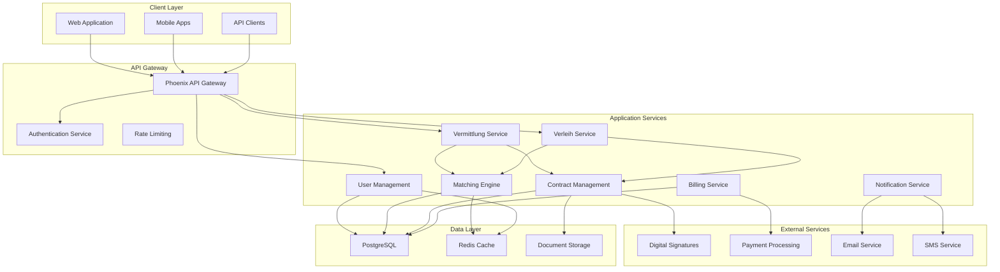

# Architecture & Design Phase

## Overview

The Architecture & Design Phase translates requirements into technical blueprints and design specifications for BemedaPersonal. This phase defines the system structure, technology choices, data architecture, security framework, and interface specifications.

---

## 🏗️ Design Components

### [System Architecture](system-architecture.md) 📝
**High-level system structure and components**
- Overall system topology and component relationships
- Microservices architecture with domain boundaries
- Communication patterns and data flow
- Deployment architecture and infrastructure design

### [Technical Architecture](technical-architecture.md) 📝
**Technology stack and infrastructure specifications**
- Elixir/Phoenix platform architecture
- Database design and data persistence strategy
- Caching, messaging, and background job processing
- DevOps pipeline and deployment automation

### [Data Architecture](data-architecture.md) 📝
**Data models, flow, and storage strategy**
- Domain data models and entity relationships
- Data flow across Vermittlung and Verleih workflows
- Storage strategy and data partitioning
- Data integration and synchronization patterns

### [Security Architecture](security-architecture.md) 📝
**Security measures and compliance framework**
- Authentication and authorization architecture
- Data encryption and protection strategy
- Swiss regulatory compliance (AVG, GDPR/DSG)
- Security monitoring and incident response

### [API Design](api-design.md) 📝
**Interface specifications and integration patterns**
- RESTful API design and documentation
- GraphQL schema and query optimization
- Third-party integration patterns
- Webhook and event-driven architecture

---

## Design Methodology

### Architecture Principles

#### 1. **Domain-Driven Design (DDD)**
- Clear separation between Vermittlung and Verleih domains
- Bounded contexts for each business capability
- Ubiquitous language aligned with Swiss employment terminology

#### 2. **Microservices Architecture**
- Independent deployability and scalability
- Failure isolation and resilience patterns
- Technology diversity where appropriate

#### 3. **Event-Driven Architecture**
- Asynchronous processing for non-blocking operations
- Event sourcing for audit trails and compliance
- Real-time updates and notifications

#### 4. **Security by Design**
- Zero-trust security model
- Defense in depth with multiple security layers
- Privacy by design for GDPR/DSG compliance

### Design Validation Framework

#### Architecture Review Process
1. **Technical Review**: Engineering team architecture assessment
2. **Security Review**: Security team threat modeling and assessment
3. **Compliance Review**: Legal team regulatory requirement validation
4. **Performance Review**: Load testing and scalability validation
5. **Stakeholder Review**: Business team alignment and approval

#### Design Quality Metrics
- **Modularity**: Clear separation of concerns and bounded contexts
- **Scalability**: Horizontal scaling capability demonstration
- **Maintainability**: Code organization and documentation quality
- **Testability**: Unit, integration, and end-to-end testing coverage
- **Observability**: Monitoring, logging, and debugging capabilities

---

## System Design Overview

### High-Level Architecture

### Domain Architecture

#### Vermittlung Domain
- **Job Management**: Job posting, application tracking
- **Candidate Management**: Profile management, matching
- **Placement Process**: Interview coordination, offer management
- **Success Fee Management**: Fee calculation and billing

#### Verleih Domain  
- **Worker Management**: PoolWorker onboarding and profiles
- **Assignment Management**: Assignment matching and tracking
- **Contract Management**: Master contracts and assignment addendums
- **Payroll Management**: Time tracking, payroll processing, client billing

#### Shared Domains
- **User Management**: Authentication, authorization, profiles
- **Communication**: Messaging, notifications, status updates
- **Document Management**: Contract generation, digital signatures
- **Compliance**: Audit trails, regulatory reporting

---

## Technology Stack Strategy

### Core Platform
- **Backend**: Elixir/Phoenix for high-availability and real-time capabilities
- **Frontend**: Phoenix LiveView with Progressive Web App (PWA) capabilities
- **Database**: PostgreSQL for transactional data with read replicas
- **Cache**: Redis for session management and performance optimization
- **Storage**: Swiss-compliant object storage for documents and media

### Integration & Communication
- **API Gateway**: Phoenix-based gateway with rate limiting and authentication
- **Message Queue**: Phoenix PubSub for internal communication
- **Background Jobs**: Oban for asynchronous processing
- **Real-time**: Phoenix Channels for live updates and notifications

### DevOps & Infrastructure
- **Containerization**: Docker for application packaging
- **Orchestration**: Kubernetes for container management and scaling
- **CI/CD**: GitLab CI with automated testing and deployment
- **Monitoring**: AppSignal for application performance monitoring
- **Infrastructure**: Swiss cloud providers for data residency compliance

---

## Design Constraints & Decisions

### Regulatory Constraints
- **Data Residency**: All personal data must remain within Switzerland
- **AVG Compliance**: Separate handling of Vermittlung and Verleih activities
- **Audit Requirements**: Complete audit trail for all business transactions
- **Privacy Requirements**: GDPR/DSG compliance with explicit consent management

### Technical Constraints
- **Performance**: Sub-200ms API response times for 95% of requests
- **Scalability**: Support for 10,000+ concurrent users
- **Availability**: 99.9% uptime with disaster recovery capabilities
- **Security**: Enterprise-grade security with encryption at rest and in transit

### Business Constraints
- **Multi-Language**: Native support for German, French, Italian, English
- **Mobile-First**: Responsive design with mobile app capabilities
- **Integration**: API-first approach for third-party system integration
- **Compliance**: Automated compliance checking and reporting

---

## Architecture Evolution Strategy

### Phase 1: MVP Architecture (Months 1-6)
- Monolithic Phoenix application with clear domain separation
- PostgreSQL database with basic caching
- Essential integrations (payment, email, digital signatures)
- Manual deployment with basic monitoring

### Phase 2: Scaling Architecture (Months 6-18)
- Microservices extraction for high-load components
- Advanced caching and database optimization
- Automated deployment pipeline and comprehensive monitoring
- API gateway and advanced security implementation

### Phase 3: Advanced Architecture (Months 18+)
- Event-driven architecture with event sourcing
- Advanced analytics and machine learning integration
- Multi-region deployment for disaster recovery
- Advanced integration marketplace and API ecosystem

---

## Risk Mitigation & Contingency

### Technical Risks
- **Scalability Bottlenecks**: Horizontal scaling design from day one
- **Integration Failures**: Circuit breaker patterns and fallback mechanisms
- **Data Loss**: Automated backups with point-in-time recovery
- **Security Breaches**: Zero-trust architecture with defense in depth

### Compliance Risks
- **Regulatory Changes**: Modular compliance framework for easy adaptation
- **Data Privacy Violations**: Privacy by design with automated compliance checking
- **Audit Failures**: Continuous compliance monitoring and validation

### Business Risks
- **Performance Degradation**: Performance monitoring with automatic scaling
- **User Experience Issues**: Comprehensive testing and user feedback integration
- **Integration Dependencies**: Vendor diversification and fallback options

---

## Design Documentation Standards

### Architecture Documentation
- **C4 Model**: Context, Container, Component, and Code level diagrams
- **Decision Records**: Architectural Decision Records (ADRs) for major choices
- **API Documentation**: OpenAPI specifications with interactive documentation
- **Data Models**: Entity-relationship diagrams with data dictionaries

### Review & Approval Process
1. **Initial Design**: Technical lead creates architecture proposal
2. **Peer Review**: Development team reviews for technical feasibility
3. **Security Review**: Security team assesses threat model and mitigation
4. **Compliance Review**: Legal team validates regulatory compliance
5. **Final Approval**: CTO approval with documented decision rationale

---

*This architecture and design phase provides the technical foundation for building a scalable, secure, and compliant BemedaPersonal platform that meets all stakeholder requirements while supporting future growth and evolution.*