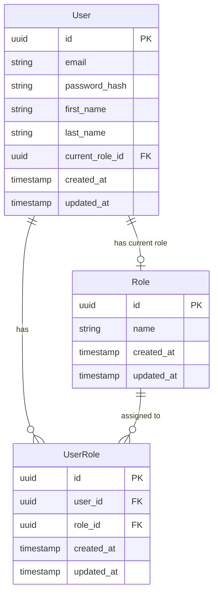

# Application Data Model

This document describes the data structures and relationships used in our application.

## Entity Relationship Diagram

## Models

### User

Represents a user in the system.

| Column          | Type      | Constraints      | Description                         |
| --------------- | --------- | ---------------- | ----------------------------------- |
| id              | uuid      | PK               | Unique identifier for the user      |
| email           | string    | unique, required | User's email address                |
| password_hash   | string    | required         | Encrypted password                  |
| first_name      | string    | required         | User's first name                   |
| last_name       | string    | required         | User's last name                    |
| current_role_id | uuid      | FK to roles      | Currently active role for this user |
| created_at      | timestamp | required         | When the record was created         |
| updated_at      | timestamp | required         | When the record was last updated    |

### Role

Represents a role that can be assigned to users.

| Column     | Type      | Constraints      | Description                              |
| ---------- | --------- | ---------------- | ---------------------------------------- |
| id         | uuid      | PK               | Unique identifier for the role           |
| name       | string    | unique, required | Name of the role (e.g., "admin", "user") |
| created_at | timestamp | required         | When the record was created              |
| updated_at | timestamp | required         | When the record was last updated         |

### UserRole

Junction table for the many-to-many relationship between users and roles.

| Column     | Type      | Constraints           | Description                          |
| ---------- | --------- | --------------------- | ------------------------------------ |
| id         | uuid      | PK                    | Unique identifier for the assignment |
| user_id    | uuid      | FK to users, required | Reference to the user                |
| role_id    | uuid      | FK to roles, required | Reference to the role                |
| created_at | timestamp | required              | When the record was created          |
| updated_at | timestamp | required              | When the record was last updated     |

## Relationships

- A User can have multiple Roles (through UserRole)
- A Role can be assigned to multiple Users (through UserRole)
- A User has one current_role (through current_role_id) which must be one of their assigned roles

## Constraints

1. The `current_role_id` in the User table must reference a role that is assigned to the user through the UserRole table
2. When deleting a Role, ensure no Users have it set as their current_role_id
3. UserRole combinations should be unique (a user shouldn't have the same role assigned multiple times)

## Indexes

- Users: email (unique)
- Users: current_role_id
- Roles: name (unique)
- UserRole: [user_id, role_id] (unique composite index)
