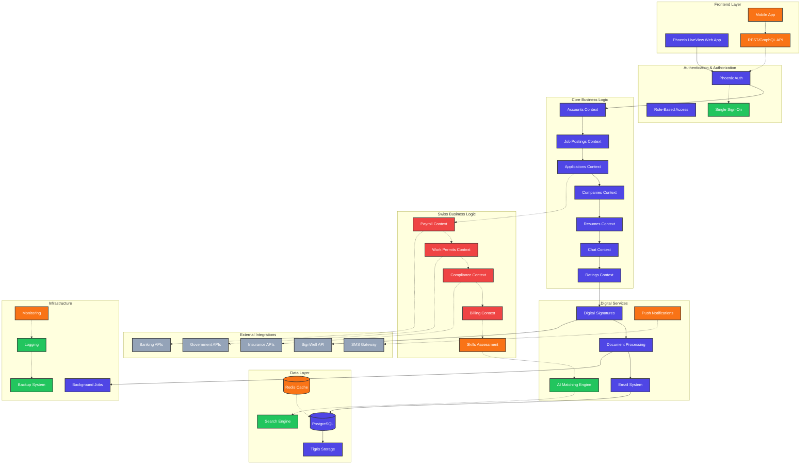
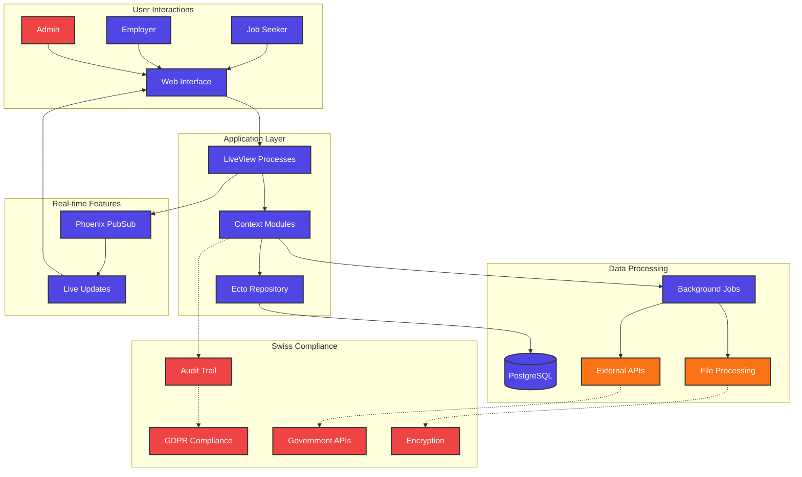
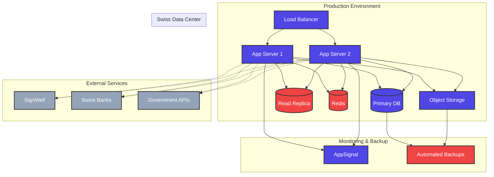

# Complete System Architecture

## Current vs. Enhanced Architecture

## Technology Stack Comparison

| Component | Current | Swiss Enhancement | Future State |
|-----------|---------|-------------------|--------------|
| **Frontend** | Phoenix LiveView | + Mobile App | + PWA |
| **Database** | PostgreSQL | + Redis Cache | + Analytics DB |
| **Auth** | Phoenix Auth | + Work Permits | + SSO/SAML |
| **Payments** | Manual | + Payroll System | + Banking APIs |
| **Documents** | Tigris + SignWell | + Compliance Docs | + AI Processing |
| **Communication** | Email + Chat | + SMS Notifications | + Video Calls |
| **Matching** | Basic Filters | + Skills Assessment | + AI Algorithms |
| **Reporting** | Basic | + Compliance Reports | + Advanced Analytics |

## Data Flow Architecture

## Deployment Architecture

