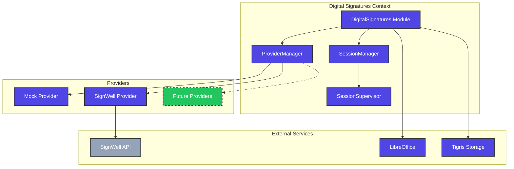
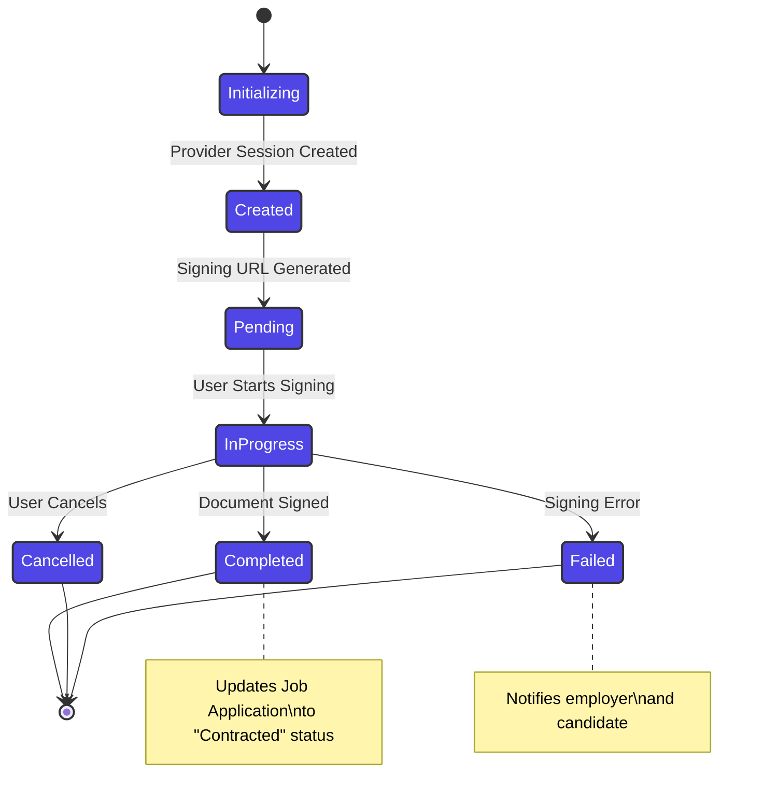
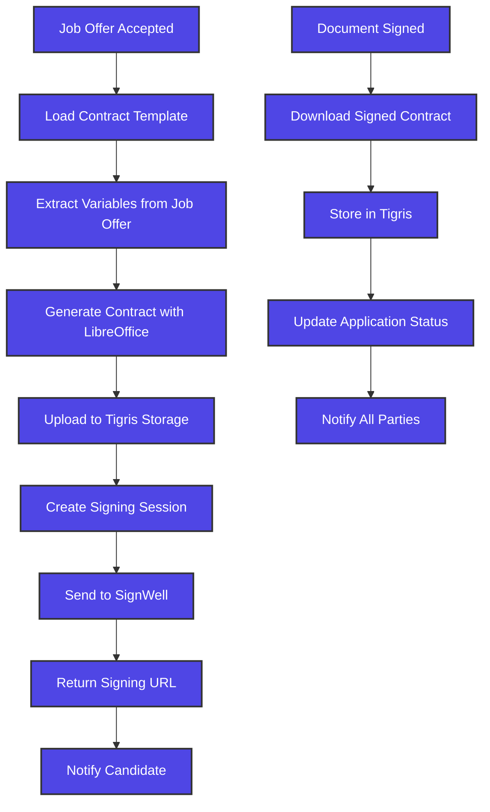

# Digital Signature Workflow

## Current Implementation

```mermaid
sequenceDiagram
    participant C as Candidate
    participant S as System
    participant G as GenServer
    participant SP as SignWell Provider
    participant E as Employer
    
    Note over C,E: Job Offer Accepted
    
    C->>S: Request Contract Signing
    S->>S: Generate Contract from Template
    S->>G: Start Signing Session
    G->>SP: Create Signing Session
    SP-->>G: Return Signing URL
    G-->>S: Session Created
    S-->>C: Redirect to Signing URL
    
    C->>SP: Sign Document
    SP->>SP: Process Signature
    SP->>G: Webhook: Document Signed
    G->>S: Update Application Status
    S->>E: Notify Contract Signed
    S->>C: Confirm Contract Completion
    
    classDef implemented fill:#4F46E5,stroke:#333,stroke-width:2px,color:#fff
    classDef external fill:#94A3B8,stroke:#333,stroke-width:2px,color:#fff
    
    class C,S,G,E implemented
    class SP external
```

## Architecture Components



## Session Lifecycle



## Contract Generation Process

