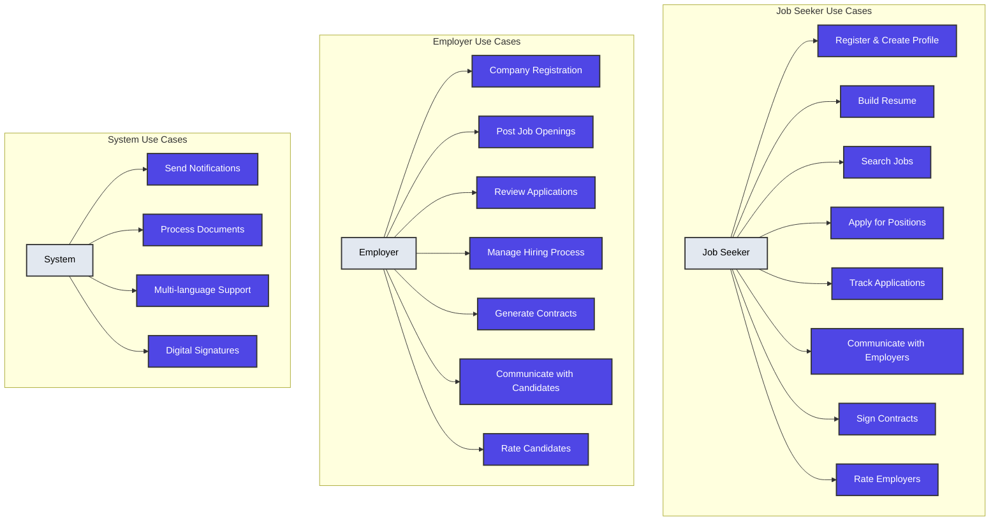
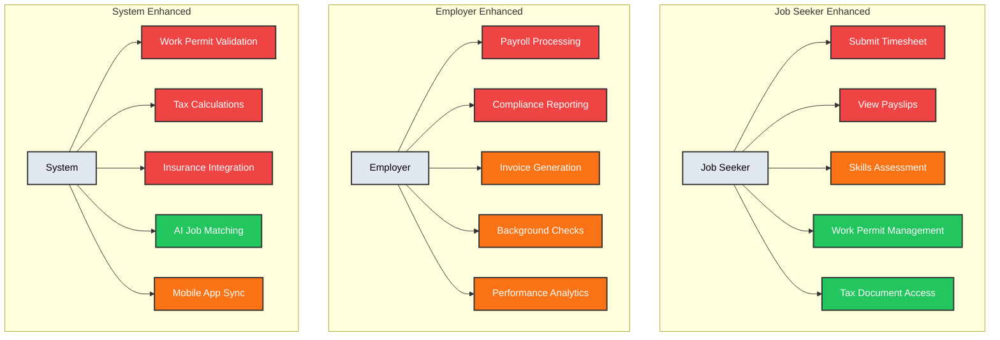

# Use Case Diagrams

## Primary Actors and Use Cases

```mermaid
graph TB
    subgraph "Job Seeker Use Cases"
        JS[Job Seeker] --> UC1[Register & Create Profile]
        JS --> UC2[Build Resume]
        JS --> UC3[Search Jobs]
        JS --> UC4[Apply for Positions]
        JS --> UC5[Track Applications]
        JS --> UC6[Communicate with Employers]
        JS --> UC7[Sign Contracts]
        JS --> UC8[Rate Employers]
    end
    
    subgraph "Employer Use Cases"
        EM[Employer] --> UC9[Company Registration]
        EM --> UC10[Post Job Openings]
        EM --> UC11[Review Applications]
        EM --> UC12[Manage Hiring Process]
        EM --> UC13[Generate Contracts]
        EM --> UC14[Communicate with Candidates]
        EM --> UC15[Rate Candidates]
    end
    
    subgraph "System Use Cases"
        SYS[System] --> UC16[Send Notifications]
        SYS --> UC17[Process Documents]
        SYS --> UC18[Multi-language Support]
        SYS --> UC19[Digital Signatures]
    end
    
    classDef implemented fill:#4F46E5,stroke:#333,stroke-width:2px,color:#fff
    classDef actor fill:#E2E8F0,stroke:#333,stroke-width:2px,color:#000
    
    class UC1,UC2,UC3,UC4,UC5,UC6,UC7,UC8,UC9,UC10,UC11,UC12,UC13,UC14,UC15,UC16,UC17,UC18,UC19 implemented
    class JS,EM,SYS actor
```

## Enhanced Use Cases (Swiss Requirements)

```mermaid
graph TB
    subgraph "Job Seeker Enhanced"
        JS[Job Seeker] --> EUC1[Submit Timesheet]
        JS --> EUC2[View Payslips]
        JS --> EUC3[Skills Assessment]
        JS --> EUC4[Work Permit Management]
        JS --> EUC5[Tax Document Access]
    end
    
    subgraph "Employer Enhanced"
        EM[Employer] --> EUC6[Payroll Processing]
        EM --> EUC7[Compliance Reporting]
        EM --> EUC8[Invoice Generation]
        EM --> EUC9[Background Checks]
        EM --> EUC10[Performance Analytics]
    end
    
    subgraph "System Enhanced"
        SYS[System] --> EUC11[Work Permit Validation]
        SYS --> EUC12[Tax Calculations]
        SYS --> EUC13[Insurance Integration]
        SYS --> EUC14[AI Job Matching]
        SYS --> EUC15[Mobile App Sync]
    end
    
    classDef critical fill:#EF4444,stroke:#333,stroke-width:2px,color:#fff
    classDef enhancement fill:#F97316,stroke:#333,stroke-width:2px,color:#fff
    classDef future fill:#22C55E,stroke:#333,stroke-width:2px,color:#fff
    classDef actor fill:#E2E8F0,stroke:#333,stroke-width:2px,color:#000
    
    class EUC1,EUC2,EUC6,EUC7,EUC11,EUC12,EUC13 critical
    class EUC3,EUC8,EUC9,EUC10,EUC15 enhancement
    class EUC4,EUC5,EUC14 future
    class JS,EM,SYS actor
```

## Use Case Relationships

```mermaid
graph TD
    A[Apply for Job] --> B[Create Profile]
    A --> C[Search Jobs]
    A --> D[Upload Documents]
    
    E[Hire Candidate] --> F[Review Applications]
    E --> G[Interview Process]
    E --> H[Generate Contract]
    
    I[Digital Signature] --> J[Contract Generation]
    I --> K[Email Notification]
    I --> L[Document Storage]
    
    M[Payroll Processing] -.-> N[Timesheet Submission]
    M -.-> O[Tax Calculation]
    M -.-> P[Bank Transfer]
    
    classDef implemented fill:#4F46E5,stroke:#333,stroke-width:2px,color:#fff
    classDef missing fill:#EF4444,stroke:#333,stroke-width:2px,color:#fff,stroke-dasharray: 5 5
    
    class A,B,C,D,E,F,G,H,I,J,K,L implemented
    class M,N,O,P missing
```