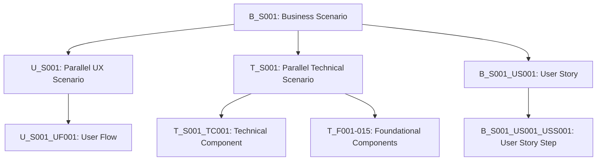

# 🚀 BDD + Actor Scenario System Integration Guide

**Version**: 2.0  
**Status**: Production Ready  
**Last Updated**: 2025-09-01  

## Overview

This directory contains the complete framework for implementing a **GitHub-First BDD + Actor Scenario System** that combines Behavior Driven Development with actor-based requirements engineering. This system is reusable across any project requiring structured requirements management.

## 🎯 What This System Solves

- **Unified Language**: Business stakeholders, developers, and testers speak the same scenario language
- **Living Documentation**: Requirements that stay in sync with implementation through automation  
- **Actor-Driven Requirements**: Every requirement has clear actors and their interactions
- **GitHub-Native**: Leverages GitHub's 2024 features (sub-issues, project views, actions)
- **Executable Specifications**: Scenarios become automated tests that validate behavior
- **Scalable Architecture**: Works for small features to enterprise platforms

## 📁 Directory Structure

```
integration/
├── theoretical-framework/       # Core concepts and theory
│   ├── bdd-actor-principles.md
│   ├── scenario-hierarchy.md
│   └── component-relationships.md
├── implementation-guide/        # Step-by-step setup instructions  
│   ├── github-setup.md
│   ├── project-structure.md
│   └── automation-workflows.md
├── templates/                   # Reusable templates
│   ├── github-issue-templates/
│   ├── project-templates/
│   └── workflow-templates/
└── examples/                    # Real implementation examples
    ├── bemeda-healthcare/
    ├── e-commerce-platform/
    └── saas-application/
```

## 🏛️ Core Architecture

### Three Scenario Types (The Trinity)

#### 🏢 **B_S (Business Scenarios)**
- **Actors**: Human stakeholders (Customers, Sales Teams, Administrators)
- **Purpose**: Define business value delivery and workflows
- **Example**: `B_S001: Cold Call to Customer Onboarding`
- **Testing**: Business acceptance tests, user journey validation

#### 🎨 **U_S (UX Scenarios)**  
- **Actors**: User interface elements (Mobile Users, Desktop Users, Accessibility Tools)
- **Purpose**: Define user experience journeys and interface interactions
- **Example**: `U_S001: Mobile Registration Experience`
- **Testing**: UI automation tests, accessibility validation

#### ⚙️ **T_S (Technical Scenarios)**
- **Actors**: System components (APIs, Databases, External Services)  
- **Purpose**: Define system interactions and technical behavior
- **Example**: `T_S001: Authentication Service Integration`
- **Testing**: Integration tests, component interaction validation

### Scenario Relationships



## 🎭 Actor-Based Requirements

Every scenario clearly defines:
- **Primary Actors**: Who initiates the scenario
- **Supporting Actors**: Who else is involved  
- **System Actors**: Which components participate
- **Success Criteria**: What constitutes successful completion
- **Failure Scenarios**: How actors handle errors

## 🔄 BDD Integration

Scenarios follow Gherkin syntax:

```gherkin
Feature: B_S001 Customer Onboarding
  In order to acquire new customers
  As a Sales Team
  We need to efficiently onboard qualified prospects

Scenario: B_S001_US001 Initial Contact
  Given a potential customer exists in our CRM
  And they match our target criteria  
  When a Sales Team member contacts them
  Then the customer should understand our value proposition
  And they should agree to a discovery call
  And the interaction should be logged in the CRM
  
  # Parallel scenario execution
  And scenario T_S001_TC001 should execute (CRM logging)
  And scenario U_S001_UF001 should execute (Sales dashboard update)
```

## 🏗️ GitHub-First Implementation

### Issues as Components
- **Parent Issues**: Major scenarios (B_S001, T_S001, U_S001)
- **Sub-Issues**: User stories, technical components, UX flows
- **Task Lists**: Individual steps and acceptance criteria
- **Cross-References**: Automatic linking between parallel scenarios

### Project Management
- **Custom Views**: Actor-based filtering (Customer Journey, Technical Components)
- **Automated Workflows**: Status updates, progress tracking, test result integration
- **Real-time Sync**: Changes in code trigger documentation updates

### Continuous Validation
- **GitHub Actions**: Automated BDD test execution on scenario changes
- **Cross-Reference Checking**: Ensures scenario relationships remain valid
- **Living Documentation**: Auto-generated documentation stays current

## 🎯 Getting Started

### For New Projects:
1. **Read**: `theoretical-framework/bdd-actor-principles.md`
2. **Follow**: `implementation-guide/github-setup.md`  
3. **Use**: Templates from `templates/` directory
4. **Reference**: Examples in `examples/` directory

### For Existing Projects:
1. **Analyze**: Your current requirements structure
2. **Map**: Existing requirements to B_S/T_S/U_S format
3. **Migrate**: Using provided migration templates
4. **Enhance**: Add BDD automation gradually

## 📊 Success Metrics

A successfully implemented system will demonstrate:

- **🔄 Living Documentation**: Requirements stay in sync automatically
- **⚡ Faster Onboarding**: New team members understand requirements quickly  
- **🎯 Better Testing**: Scenarios become executable specifications
- **🤝 Improved Collaboration**: All stakeholders speak same language
- **📈 Higher Quality**: Behavioral requirements prevent implementation gaps
- **🏗️ Reusable Patterns**: Components work across multiple projects

## 🌟 Advanced Features

- **Multi-Project Templates**: Reusable scenario patterns across projects
- **Actor Inheritance**: Scenario variations share common actor behaviors  
- **Component Versioning**: Track scenario evolution and breaking changes
- **Cross-Platform Sync**: Same scenarios work in different environments
- **AI-Assisted Generation**: Tools help generate scenarios from natural language

## 🤝 Contributing

This framework is designed to evolve. Contributions welcome for:
- New scenario patterns and templates
- Additional GitHub automation workflows
- Integration with other tools and platforms
- Case studies and implementation examples

---

**Next Steps**: Start with `theoretical-framework/bdd-actor-principles.md` to understand the core concepts, then proceed to `implementation-guide/github-setup.md` for hands-on setup.

**Support**: This framework was developed and validated on the Bemeda Healthcare Talent Platform and is production-ready for enterprise use.