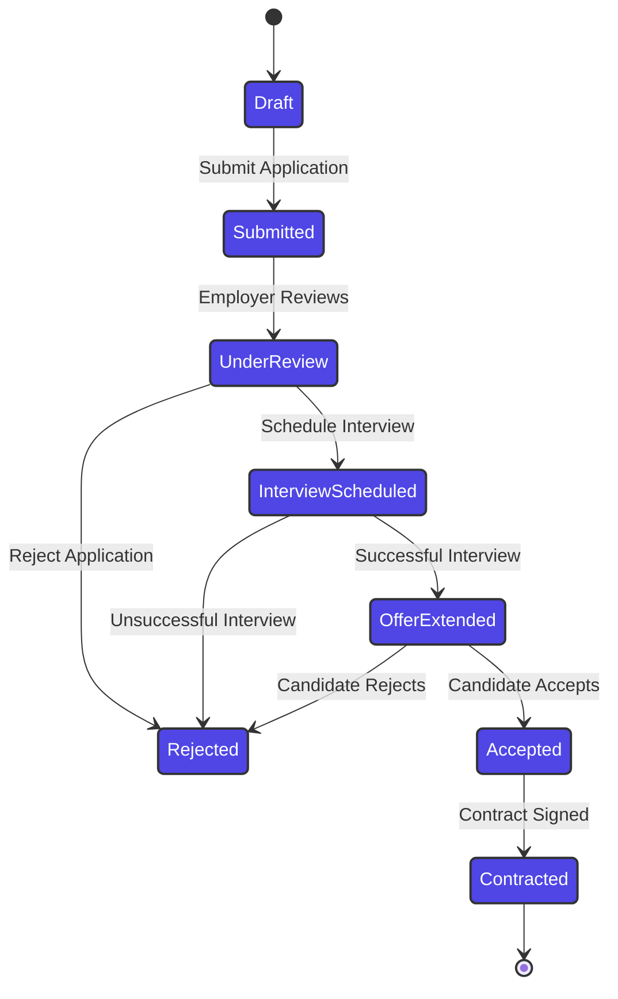
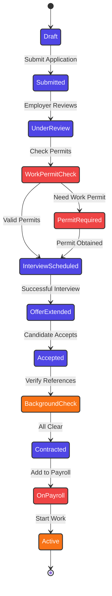

# Application Lifecycle

## Current State Machine

---

## Swiss Enhancement Requirements

---

## Implementation Details

### Current Implementation (FSMX)
- **State Machine**: Using FSMX library for state transitions
- **Persistence**: States stored in `job_application_state_transitions` table
- **Events**: Triggered by user actions and system events
- **Validation**: Business rules enforced at transition level

### Required Enhancements
- **Work Permit Integration**: API integration with Swiss authorities
- **Background Checks**: Automated reference verification
- **Payroll Integration**: Connection to Swiss payroll systems
- **Compliance Tracking**: SUVA, AHV, accident insurance