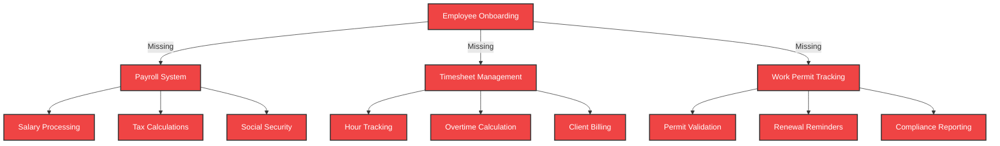
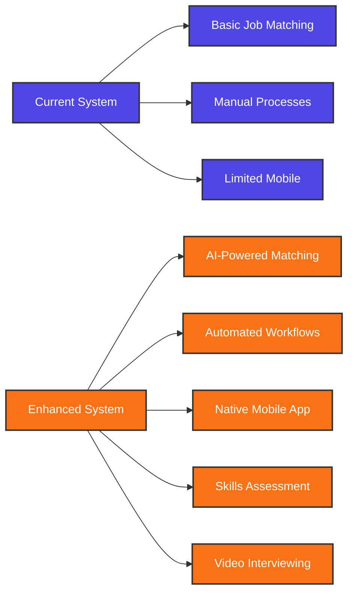

# Gap Analysis

## Critical Missing Features

### Payroll & Administration

---

## Enhancement Opportunities

### User Experience

---

## Swiss Market Requirements

### Compliance Features
- **Data Protection**: GDPR/Swiss DPA compliance
- **Employment Law**: Swiss labor regulations
- **Multi-language**: German, French, Italian, Romansh
- **Work Permits**: EU/EFTA vs. third-country nationals
- **Insurance**: SUVA, accident, unemployment
- **Taxation**: Cantonal tax variations

### Business Requirements
- **Temporary Staffing**: Flexible contract management
- **Cross-border**: Germany, France, Austria, Italy
- **Industry Specific**: Healthcare, IT, hospitality
- **Seasonal Work**: Tourism, agriculture
- **Apprenticeships**: Dual education system

---

## Priority Matrix

| Feature | Swiss Requirement | Business Impact | Technical Complexity |
|---------|-------------------|-----------------|---------------------|
| Payroll System | **Critical** | High | High |
| Work Permit Management | **Critical** | High | Medium |
| Mobile App | Enhancement | Medium | Medium |
| AI Matching | Future | High | High |
| Skills Assessment | Enhancement | Medium | Low |
| Video Interviewing | Enhancement | Medium | Medium |