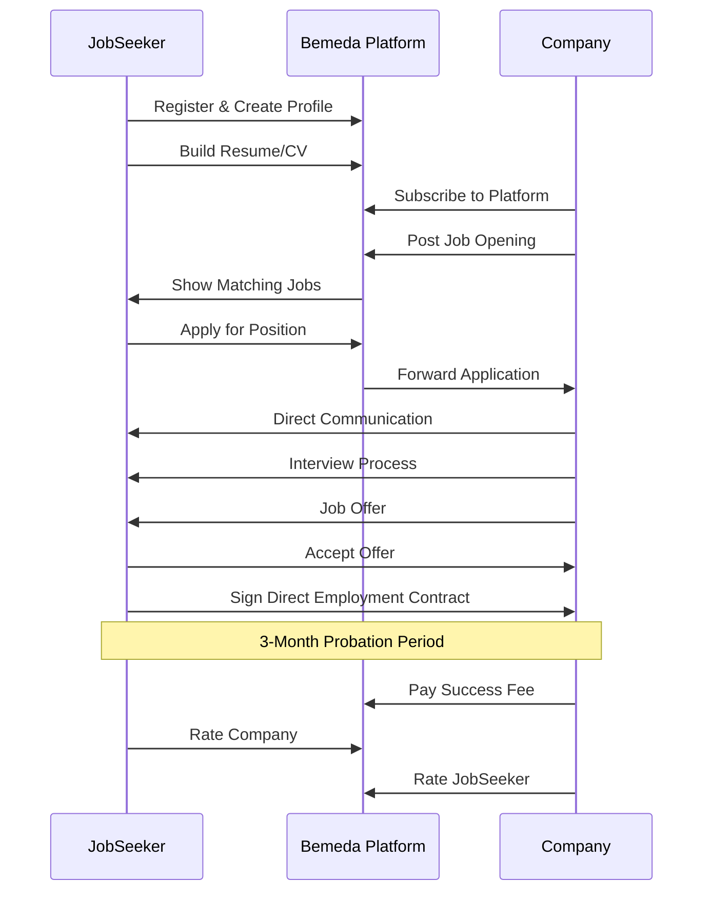
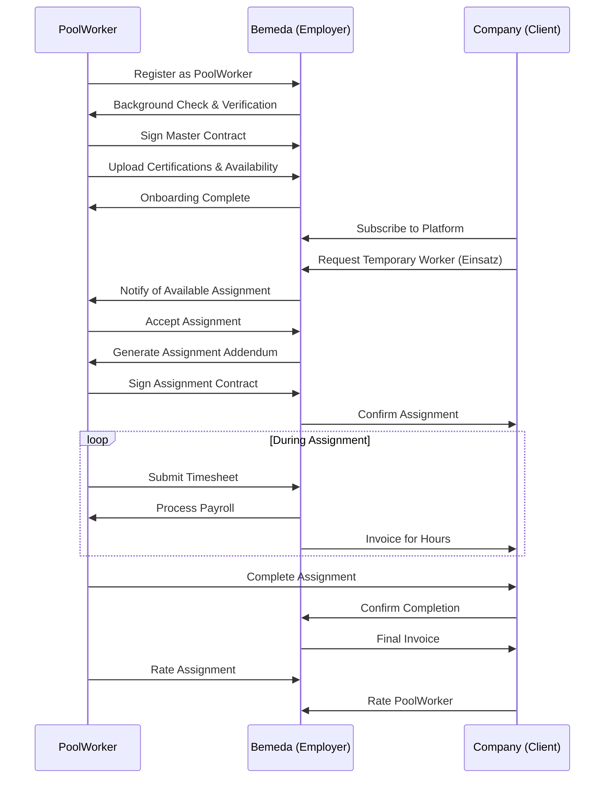
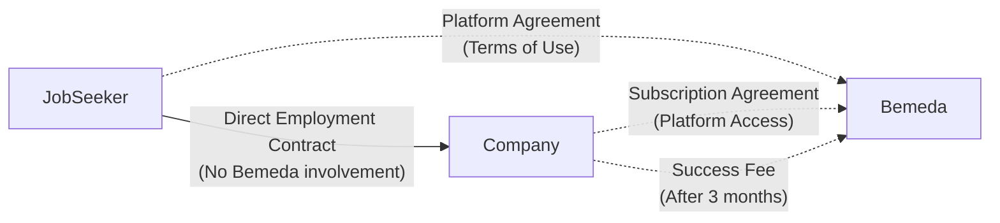
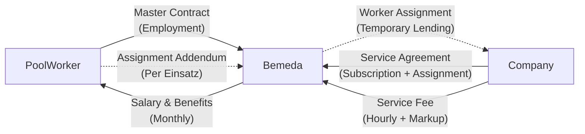

# Use Cases

## Overview

BemedaPersonal operates two distinct business workflows:
1. **Vermittlung (Placement)**: JobSeeker ↔ Company (direct employment)
2. **Verleih (Lending)**: PoolWorker ↔ Bemeda ↔ Company (temporary employment)

## Use Case 1: JobSeeker - Company (Vermittlung)

### Workflow: Direct Employment Through Placement

**Actors**: JobSeeker, Company, Bemeda (facilitator)
**Contract**: Direct employment contract between JobSeeker and Company
**Payment**: Company pays success fee to Bemeda after 3-month probation period

**Key Characteristics**:
- Bemeda acts as intermediary only
- No employer relationship between Bemeda and JobSeeker
- Direct contract and communication between JobSeeker and Company
- One-time success fee after successful placement
- AVG Art. 3 compliance: No agency employment relationship

### Detailed Steps

#### JobSeeker Journey (Vermittlung)
1. **Registration & Profile Creation**
   - Create account with personal details
   - Upload CV and professional documents
   - Set job preferences and salary expectations
   - Complete skills assessment

2. **Job Search & Application**
   - Browse job postings from subscribed companies
   - Use matching algorithm suggestions
   - Apply directly through platform
   - Track application status

3. **Interview & Hiring Process**
   - Receive interview invitations directly from companies
   - Participate in company-managed interview process
   - Negotiate terms directly with company
   - Sign employment contract with company (not Bemeda)

4. **Post-Placement**
   - Start employment with 3-month probation period
   - Rate experience with company
   - Bemeda receives success fee from company after probation

#### Company Journey (Vermittlung)
1. **Platform Subscription**
   - Register company profile
   - Choose subscription tier for platform access
   - Set up billing and payment methods

2. **Job Posting & Candidate Search**
   - Create job postings with requirements
   - Access JobSeeker profiles and resumes
   - Use platform matching suggestions
   - Search and filter candidates

3. **Hiring Process Management**
   - Review applications through platform
   - Communicate directly with candidates
   - Manage interview scheduling
   - Make job offers and handle negotiations

4. **Employment & Payment**
   - Sign direct employment contract with JobSeeker
   - Manage probation period
   - Pay success fee to Bemeda after successful completion
   - Rate hired JobSeeker

## Use Case 2: PoolWorker - Bemeda - Company (Verleih)

### Workflow: Temporary Employment Through Lending

**Actors**: PoolWorker, Bemeda (employer), Company (client)
**Contracts**: Master contract (Bemeda-PoolWorker) + Assignment addendums per Einsatz
**Payment**: Company pays hourly/markup fees to Bemeda; Bemeda pays salary to PoolWorker

**Key Characteristics**:
- Bemeda is legal employer of PoolWorker
- Separate contracts required for each assignment (Einsatz)
- Continuous payroll and social insurance obligations
- Hourly billing with markup to client company
- AVG Art. 12-15 compliance: Full employer responsibilities

### Detailed Steps

#### PoolWorker Journey (Verleih)
1. **Registration & Onboarding**
   - Register with personal and professional details
   - Complete background check and verification process
   - Sign master employment contract with Bemeda
   - Upload certifications, licenses, and qualifications
   - Set availability calendar and preferences

2. **Assignment Matching & Acceptance**
   - Receive notifications for matching assignments
   - Review assignment details and requirements
   - Accept or decline assignment offers
   - Sign assignment-specific contract addendum

3. **Assignment Execution**
   - Report to client company for assignment
   - Perform work as directed by client
   - Submit daily/weekly timesheets to Bemeda
   - Communicate issues or concerns to Bemeda

4. **Assignment Completion & Payroll**
   - Complete assignment and confirm end date
   - Receive salary from Bemeda (monthly/bi-weekly)
   - Rate assignment and client company
   - Prepare for next available assignment

#### Company Journey (Verleih)
1. **Platform Subscription & Setup**
   - Subscribe to platform for temporary worker access
   - Complete company verification process
   - Set up preferred billing and payment methods

2. **Assignment Request**
   - Create temporary worker requests (Einsatz)
   - Specify skills, duration, and requirements
   - Set assignment details and working conditions
   - Confirm budget and hourly rates

3. **Worker Assignment & Management**
   - Review and approve matched PoolWorkers
   - Receive worker assignment confirmation from Bemeda
   - Manage day-to-day work assignments
   - Coordinate with Bemeda for any issues

4. **Billing & Completion**
   - Receive invoices from Bemeda for worker hours
   - Pay service fees (PoolWorker salary + markup)
   - Confirm assignment completion
   - Rate PoolWorker performance

#### Bemeda Operations (Verleih)
1. **PoolWorker Employment Management**
   - Conduct background checks and onboarding
   - Maintain master employment contracts
   - Process monthly payroll and benefits
   - Handle all social insurance obligations (AHV/IV/EO, BVG, etc.)

2. **Assignment Coordination**
   - Match PoolWorkers to client requests
   - Generate assignment-specific contracts
   - Coordinate start dates and logistics
   - Monitor assignment progress

3. **Financial Management**
   - Track PoolWorker hours and timesheets
   - Calculate client invoices (salary + markup)
   - Process payroll for PoolWorkers
   - Manage all employment-related taxes and insurance

## Contract Structures Comparison

### Vermittlung (Placement) Contracts

### Verleih (Lending) Contracts  

## Regulatory Compliance

| Aspect | Vermittlung | Verleih |
|--------|-------------|----------|
| **AVG Articles** | Art. 3 (No agency employment) | Art. 12-15 (Full employment) |
| **Contracts** | Platform access only | Master + Assignment addendums |
| **Employer Duties** | None (Company is employer) | Full (Bemeda is employer) |
| **Social Insurance** | Company responsibility | Bemeda responsibility |
| **Payroll** | Company handles | Bemeda processes |
| **Work Permits** | Company verifies | Bemeda verifies |
| **Liability** | Limited to placement | Full employment liability |

## Business Model Integration

**Unified Platform Features**:
- Single registration and authentication system
- Shared user profiles with role-based access
- Integrated messaging and notification system  
- Common rating and review system
- Unified subscription management for companies
- Cross-workflow reporting and analytics

**Workflow-Specific Features**:

| Feature | Vermittlung | Verleih |
|---------|-------------|----------|
| **Profile Type** | CV/Resume focus | Availability + Skills |
| **Matching** | Job posting → Application | Assignment request → Availability |
| **Communication** | Direct (Company ↔ JobSeeker) | Mediated (via Bemeda) |
| **Contracts** | One-time direct employment | Recurring assignment contracts |
| **Billing** | Success fee (post-probation) | Hourly/markup (ongoing) |
| **Timeline** | Long-term placement | Short-term assignments |

## System Architecture Implications

### Shared Components
- User authentication and authorization
- Profile management system
- Messaging and notifications
- Rating and review system
- Document management and digital signatures
- Subscription and billing management

### Vermittlung-Specific Components  
- Job posting management
- Application tracking system
- Direct communication channels
- Success fee calculation and billing
- Probation period tracking

### Verleih-Specific Components
- Master contract management
- Assignment contract generation
- Availability calendar system
- Timesheet submission and tracking
- Payroll processing system
- Social insurance integration
- Hourly billing and invoicing

### Integration Points
- Unified user dashboard with role-based views
- Cross-workflow analytics and reporting
- Shared company subscription management
- Common compliance and audit trails
- Integrated notification system across both workflows