# User Stories

## Overview

Medical-focused user stories capture the healthcare professional experience and specialized value proposition of BemedaPersonal. These stories showcase innovative features specific to Swiss healthcare staffing, highlighting our Medical Pool Worker system, FMH credential verification, GAV compliance, and comprehensive medical sector expertise.

---

## Story Categories

### 🔵 Core Platform Stories
Essential functionality for basic operations

### 🟢 Differentiation Stories  
Innovative features that set us apart from competitors

### 🟡 Pool Worker Innovation
Next-generation flexible workforce management

### 🟠 AI-Powered Intelligence
Smart matching and predictive capabilities

### 🔴 Premium Services
High-value services for enterprise clients

---

## 🔵 Core Platform Stories

### Story 1: Medical Professional Career Advancement
**As a** registered nurse seeking specialization advancement  
**I want to** receive personalized career path guidance with FMH credential verification  
**So that** I can advance to ICU or OR nursing with proper certification support

<strong>🏥 Medical Specialization:</strong> Focus on healthcare career advancement within medical specializations rather than industry transitions.

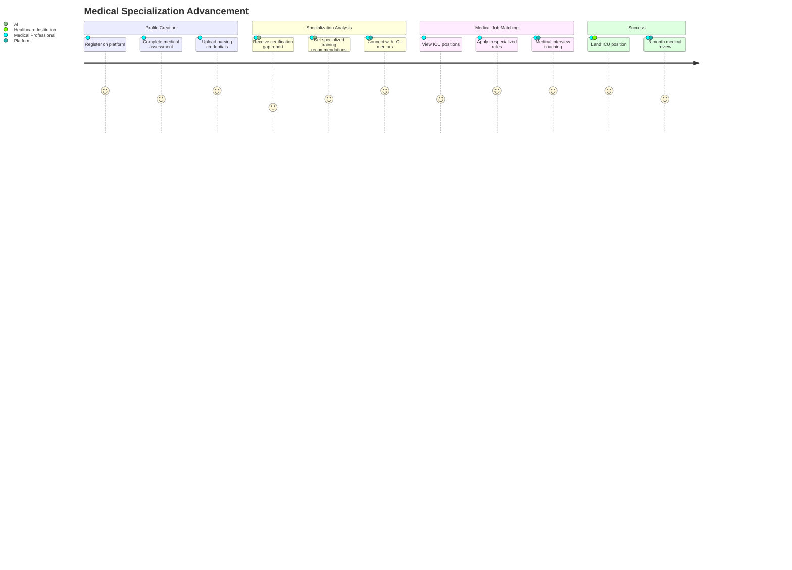

### Story 2: Private Practice First Medical Hire
**As a** private practice owner hiring my first medical assistant  
**I want to** understand Swiss medical employment requirements and get GAV-compliant contracts  
**So that** I can hire medical staff confidently without regulatory risks

<strong>🏥 Medical Compliance:</strong> Specialized guidance for healthcare institution hiring with GAV compliance and medical licensing requirements.

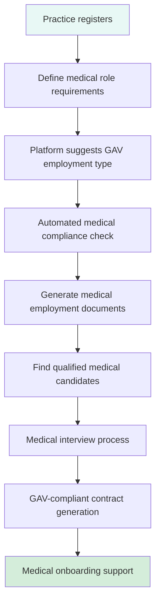

---

## 🟢 Differentiation Stories

### Story 3: Smart Healthcare Institution Matching
**As a** medical professional with specific practice preferences  
**I want to** find healthcare institutions that match my medical practice style and values  
**So that** I find not just a position, but the right medical environment fit

<strong>🏥 Medical Culture Matching:</strong> Healthcare-specific cultural fit including patient care philosophy, medical technology preferences, and specialization focus.

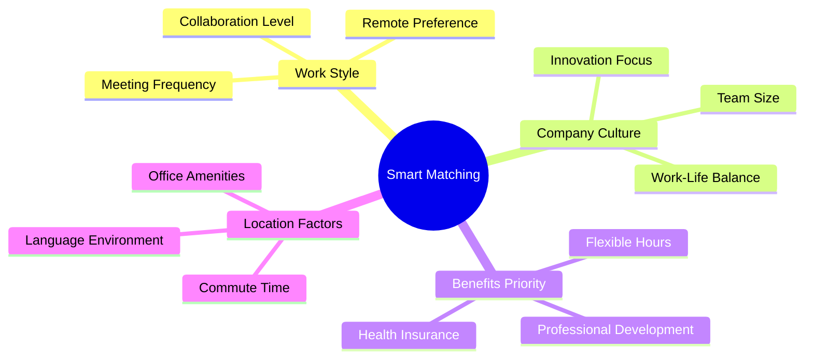

### Story 4: Multi-Language Job Posting
**As a** international company in Switzerland  
**I want to** post jobs in multiple languages simultaneously  
**So that** I can attract diverse talent from all Swiss language regions

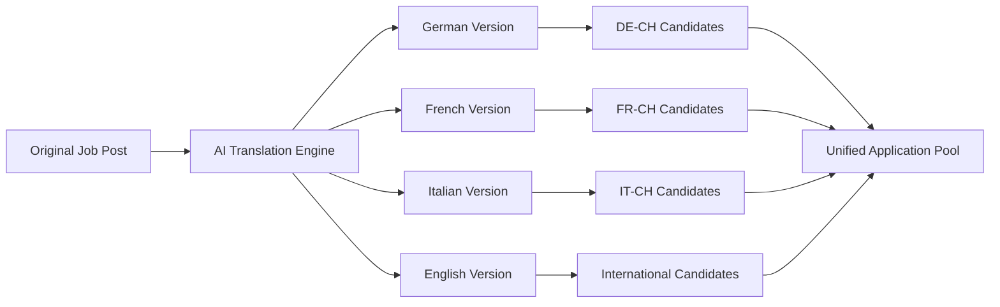

---

## 🟡 Pool Worker Innovation Stories

### Story 5: Flexible Medical Pool Worker
**As a** registered nurse employed by BemedaPersonal wanting flexible medical schedules  
**I want to** set my availability preferences and get matched to suitable medical shifts with GAV compliance  
**So that** I can maintain work-life balance while staying professionally active across multiple healthcare institutions

<strong>🏥 Medical Pool Worker Innovation:</strong> GAV-compliant flexible medical employment with assignments across hospitals, clinics, and specialized care facilities.

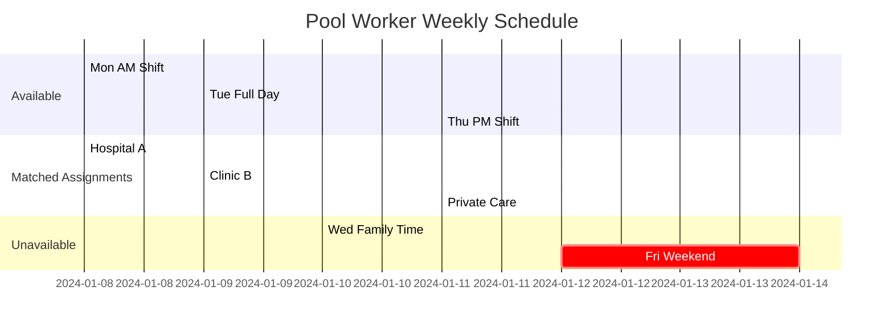

### Story 6: Medical Professional Specialization Building
**As a** medical professional seeking diverse clinical experience  
**I want to** work assignments across different medical specializations and healthcare settings  
**So that** I can build comprehensive medical experience and expand my clinical expertise

<strong>🏥 Medical Experience Diversification:</strong> Clinical assignments across various medical specializations to build comprehensive healthcare expertise.

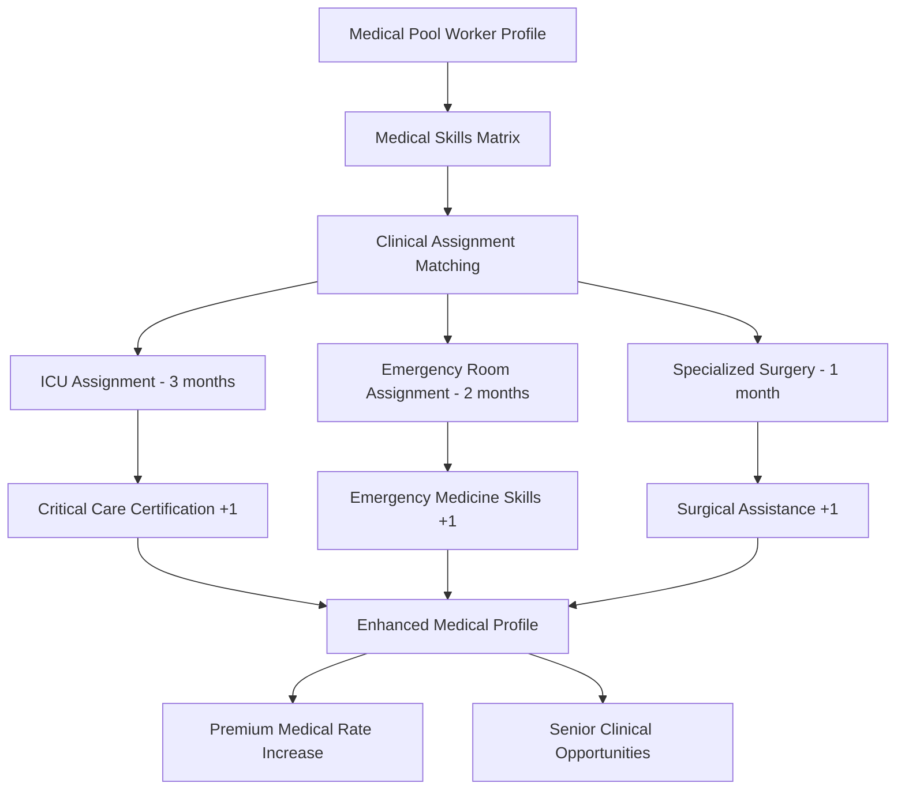

---

## 🟠 AI-Powered Intelligence Stories

### Story 7: Predictive Medical Staffing Planning
**As a** hospital HR director managing seasonal patient load variations  
**I want to** receive predictions about future medical staffing needs based on patient admission trends  
**So that** I can plan medical recruitment campaigns proactively for peak periods

<strong>🏥 Medical Workforce Intelligence:</strong> Healthcare-specific predictive analytics considering patient admission patterns, seasonal medical needs, and clinical specialization requirements.

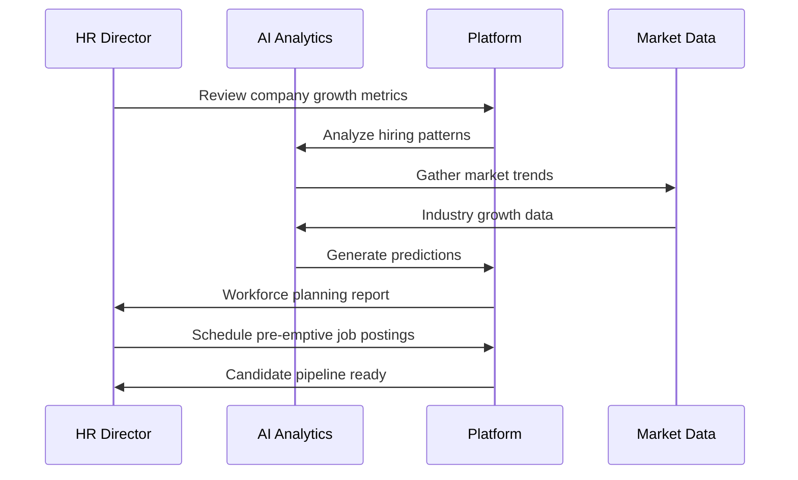

### Story 8: Skills Evolution Tracking
**As a** professional in a rapidly changing field  
**I want to** receive alerts about emerging skills in my industry  
**So that** I can stay competitive and relevant in the job market

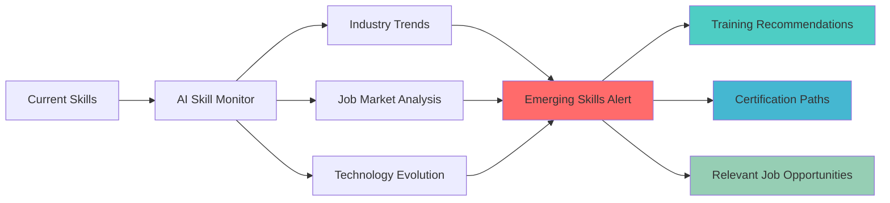

---

## 🔴 Premium Services Stories

### Story 9: Executive Search with Social Media Intelligence
**As an** executive search consultant  
**I want to** leverage social media insights to identify and approach passive candidates  
**So that** I can find top-tier talent who aren't actively job searching

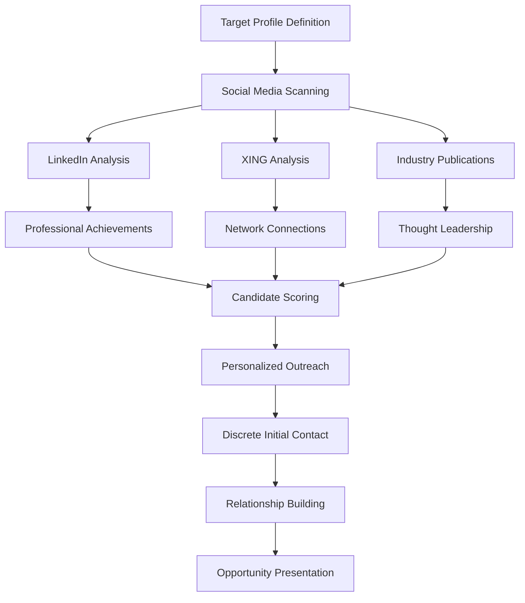

### Story 10: Compliance Automation for Large Enterprises
**As a** multinational corporation's Swiss HR manager  
**I want to** automate compliance checking across all hiring processes  
**So that** I can ensure 100% AVG compliance without manual oversight

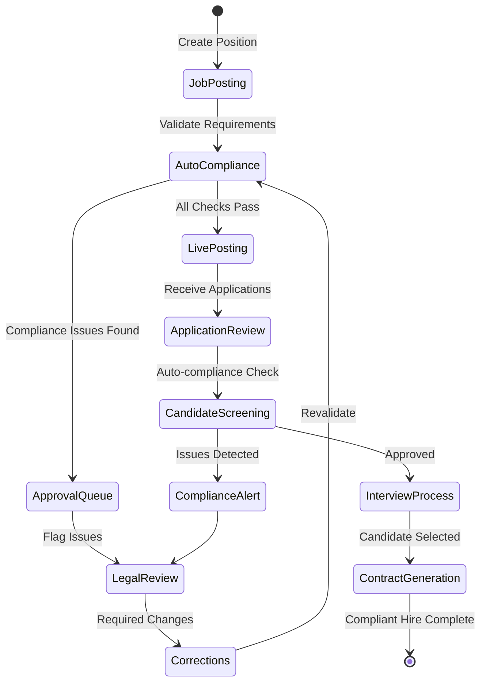

---

## 🎯 Competitive Differentiation Scenarios

### Scenario 1: "Instant Pool Worker Response"
**Traditional Problem**: Urgent staffing needs take days to resolve  
**BemedaPersonal Solution**: Real-time Pool Worker notification with 15-minute response commitment

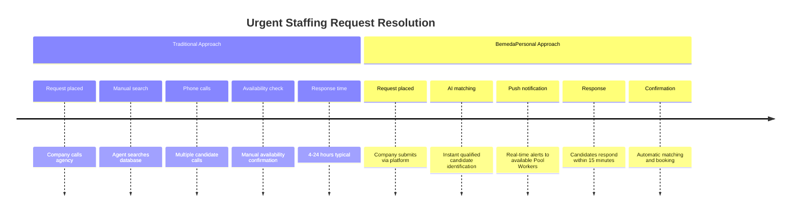

### Scenario 2: "Career Trajectory Optimization"
**Traditional Problem**: Job seekers make career moves without strategic guidance  
**BemedaPersonal Solution**: AI-powered career path optimization with salary prediction

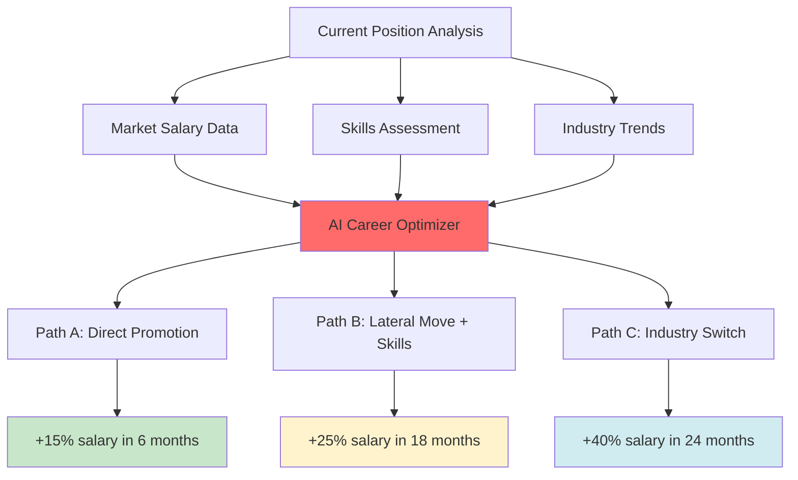

### Scenario 3: "Swiss Compliance Guarantee"
**Traditional Problem**: Companies risk non-compliance with complex Swiss employment law  
**BemedaPersonal Solution**: 100% compliance guarantee with legal insurance backing

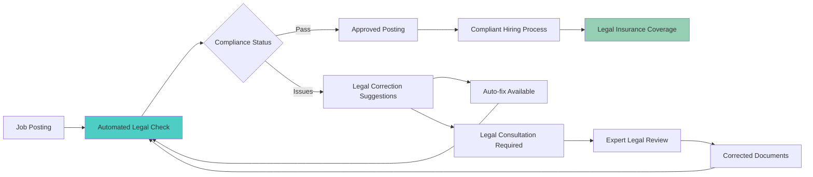

---

## 📊 Success Metrics for User Stories

### Engagement Metrics
- **Story Completion Rate**: 95%+ users complete their primary journey
- **Feature Adoption**: 80%+ users engage with differentiation features
- **Pool Worker Utilization**: 70%+ pool workers active monthly

### Satisfaction Metrics  
- **Net Promoter Score**: Target 70+ across all user types
- **Success Rate**: 90%+ successful placements complete probation period
- **Response Time**: <15 minutes for urgent Pool Worker requests

### Business Impact Metrics
- **Revenue per User**: 25% higher than traditional platforms
- **Compliance Score**: 100% audit success rate
- **Market Differentiation**: 40% of customers cite unique features as decision factor

---

## 🔄 Story Implementation Priority

### Phase 1: Foundation (Months 1-6)
- Core platform stories (Stories 1-2)
- Basic Pool Worker functionality (Story 5)
- Essential compliance features (Story 10 foundation)

### Phase 2: Differentiation (Months 7-12)
- Smart matching and cultural fit (Story 3)
- Multi-language capabilities (Story 4)
- Advanced Pool Worker features (Story 6)

### Phase 3: Intelligence (Months 13-18)
- AI-powered workforce planning (Story 7)
- Skills evolution tracking (Story 8)
- Executive search capabilities (Story 9)

### Phase 4: Market Leadership (Months 19-24)
- Full premium services suite
- Complete competitive differentiation
- Advanced compliance automation

---

*These user stories define the human experience that will make BemedaPersonal the definitive platform for Swiss personnel services, combining innovative technology with deep market understanding.*