# User Stories

## Overview

User stories capture the human experience and value proposition of BemedaPersonal from all stakeholder perspectives. These stories showcase innovative features that differentiate us from traditional recruitment platforms and highlight our Pool Worker system, AI-powered matching, and comprehensive Swiss compliance approach.

---

## Story Categories

### 🔵 Core Platform Stories
Essential functionality for basic operations

### 🟢 Differentiation Stories  
Innovative features that set us apart from competitors

### 🟡 Pool Worker Innovation
Next-generation flexible workforce management

### 🟠 AI-Powered Intelligence
Smart matching and predictive capabilities

### 🔴 Premium Services
High-value services for enterprise clients

---

## 🔵 Core Platform Stories

### Story 1: JobSeeker Career Transition
**As a** healthcare professional changing careers to IT  
**I want to** receive personalized career transition guidance and skill gap analysis  
**So that** I can successfully pivot to a new industry with confidence

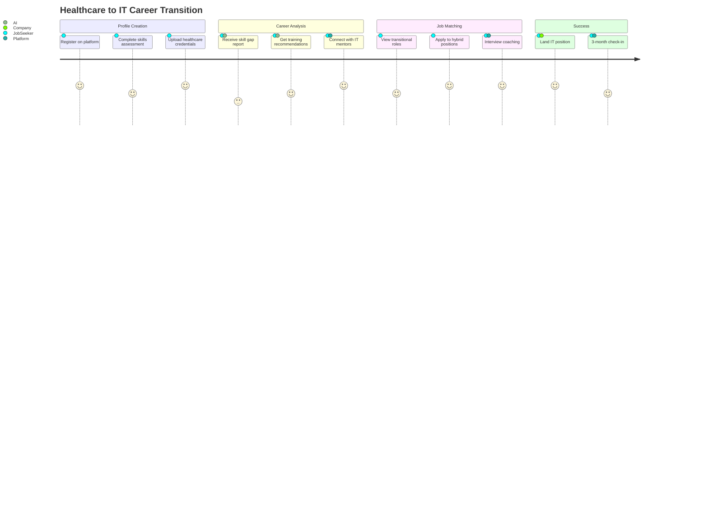

### Story 2: Small Company First Hire
**As a** startup founder hiring my first employee  
**I want to** understand Swiss employment law requirements and get compliant contracts  
**So that** I can hire confidently without legal risks

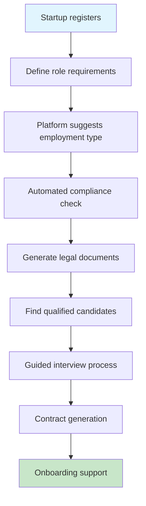

---

## 🟢 Differentiation Stories

### Story 3: Smart Company Matching
**As a** job seeker with specific cultural preferences  
**I want to** find companies that match my work style and values  
**So that** I find not just a job, but the right cultural fit

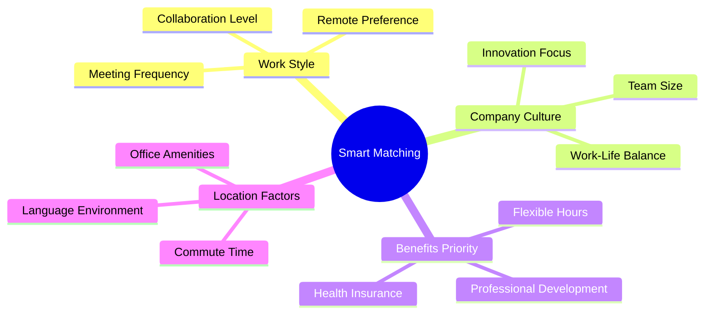

### Story 4: Multi-Language Job Posting
**As a** international company in Switzerland  
**I want to** post jobs in multiple languages simultaneously  
**So that** I can attract diverse talent from all Swiss language regions

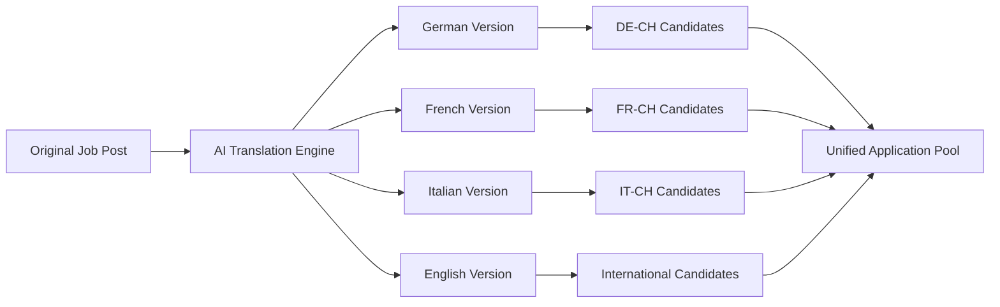

---

## 🟡 Pool Worker Innovation Stories

### Story 5: Flexible Healthcare Professional
**As a** registered nurse wanting flexible schedules  
**I want to** set my availability preferences and get matched to suitable shifts  
**So that** I can maintain work-life balance while staying professionally active

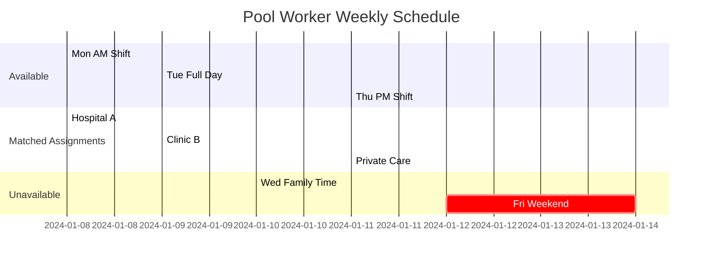

### Story 6: IT Contractor Portfolio Building
**As an** IT contractor seeking diverse experience  
**I want to** work on projects across different industries and technologies  
**So that** I can build a strong portfolio and expand my skillset

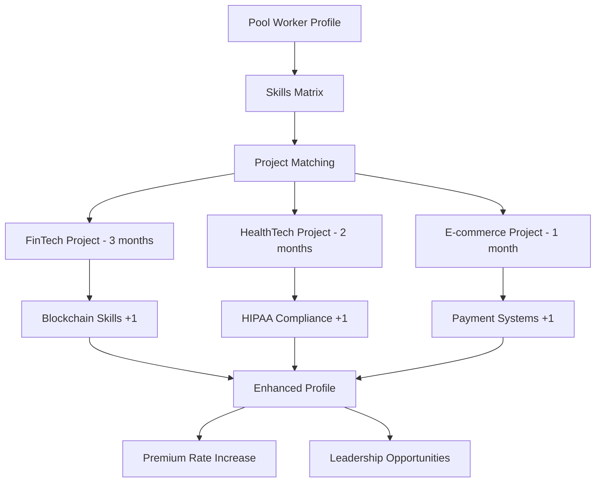

---

## 🟠 AI-Powered Intelligence Stories

### Story 7: Predictive Workforce Planning
**As an** HR director at a growing company  
**I want to** receive predictions about future hiring needs based on business trends  
**So that** I can plan recruitment campaigns proactively

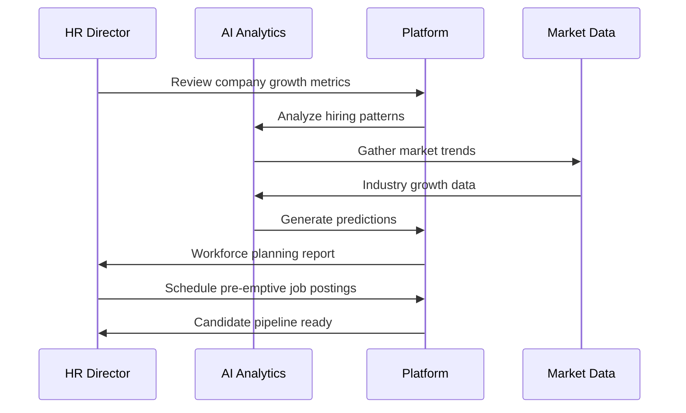

### Story 8: Skills Evolution Tracking
**As a** professional in a rapidly changing field  
**I want to** receive alerts about emerging skills in my industry  
**So that** I can stay competitive and relevant in the job market

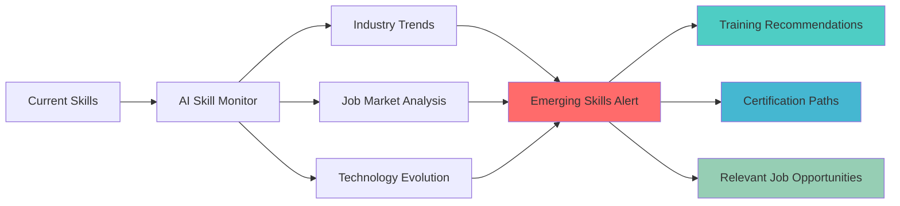

---

## 🔴 Premium Services Stories

### Story 9: Executive Search with Social Media Intelligence
**As an** executive search consultant  
**I want to** leverage social media insights to identify and approach passive candidates  
**So that** I can find top-tier talent who aren't actively job searching

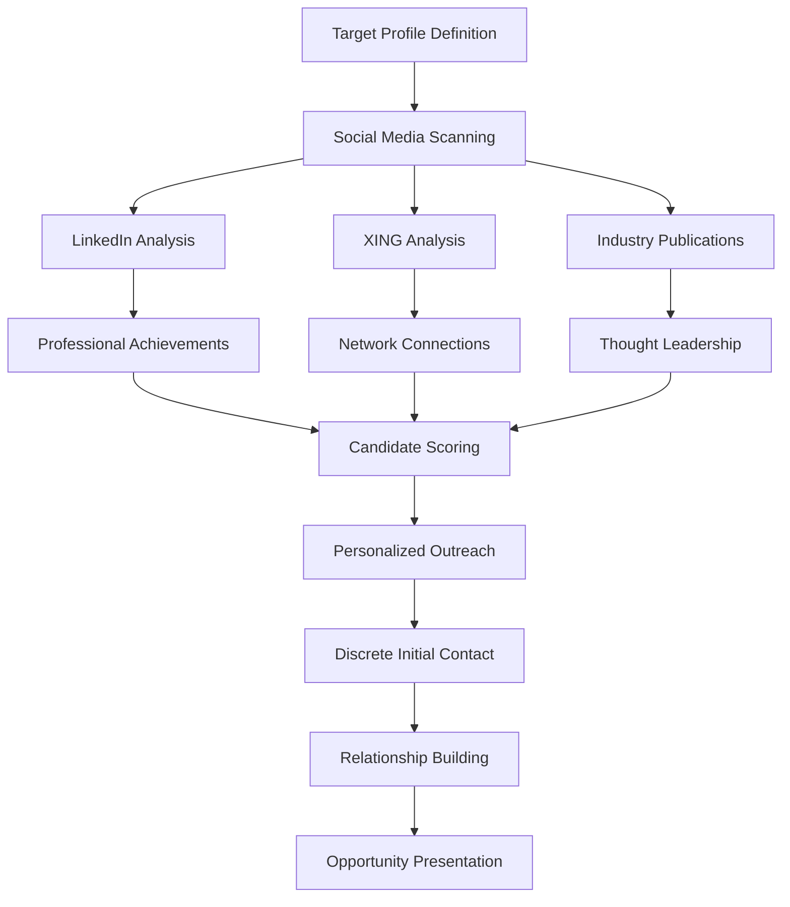

### Story 10: Compliance Automation for Large Enterprises
**As a** multinational corporation's Swiss HR manager  
**I want to** automate compliance checking across all hiring processes  
**So that** I can ensure 100% AVG compliance without manual oversight

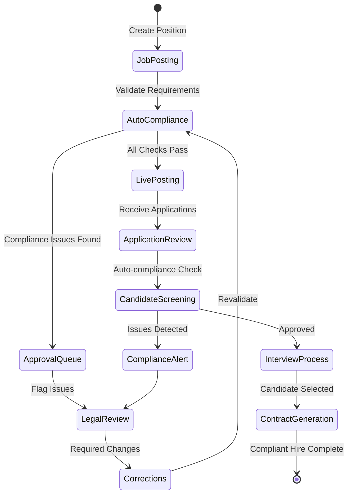

---

## 🎯 Competitive Differentiation Scenarios

### Scenario 1: "Instant Pool Worker Response"
**Traditional Problem**: Urgent staffing needs take days to resolve  
**BemedaPersonal Solution**: Real-time Pool Worker notification with 15-minute response commitment

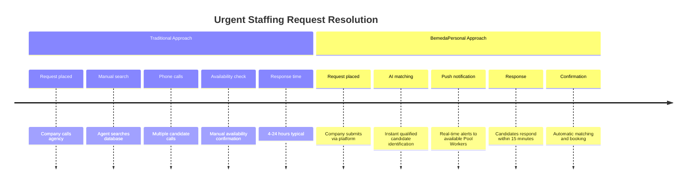

### Scenario 2: "Career Trajectory Optimization"
**Traditional Problem**: Job seekers make career moves without strategic guidance  
**BemedaPersonal Solution**: AI-powered career path optimization with salary prediction

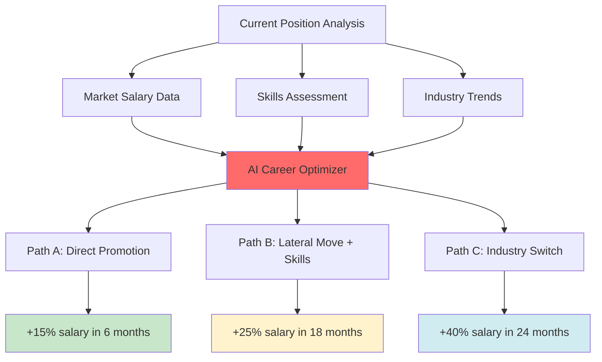

### Scenario 3: "Swiss Compliance Guarantee"
**Traditional Problem**: Companies risk non-compliance with complex Swiss employment law  
**BemedaPersonal Solution**: 100% compliance guarantee with legal insurance backing

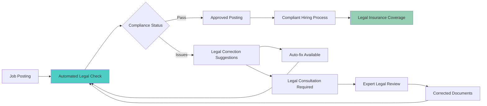

---

## 📊 Success Metrics for User Stories

### Engagement Metrics
- **Story Completion Rate**: 95%+ users complete their primary journey
- **Feature Adoption**: 80%+ users engage with differentiation features
- **Pool Worker Utilization**: 70%+ pool workers active monthly

### Satisfaction Metrics  
- **Net Promoter Score**: Target 70+ across all user types
- **Success Rate**: 90%+ successful placements complete probation period
- **Response Time**: <15 minutes for urgent Pool Worker requests

### Business Impact Metrics
- **Revenue per User**: 25% higher than traditional platforms
- **Compliance Score**: 100% audit success rate
- **Market Differentiation**: 40% of customers cite unique features as decision factor

---

## 🔄 Story Implementation Priority

### Phase 1: Foundation (Months 1-6)
- Core platform stories (Stories 1-2)
- Basic Pool Worker functionality (Story 5)
- Essential compliance features (Story 10 foundation)

### Phase 2: Differentiation (Months 7-12)
- Smart matching and cultural fit (Story 3)
- Multi-language capabilities (Story 4)
- Advanced Pool Worker features (Story 6)

### Phase 3: Intelligence (Months 13-18)
- AI-powered workforce planning (Story 7)
- Skills evolution tracking (Story 8)
- Executive search capabilities (Story 9)

### Phase 4: Market Leadership (Months 19-24)
- Full premium services suite
- Complete competitive differentiation
- Advanced compliance automation

---

*These user stories define the human experience that will make BemedaPersonal the definitive platform for Swiss personnel services, combining innovative technology with deep market understanding.*