# User Stories

## Überblick

Medizinisch fokussierte User Stories erfassen die Gesundheitsfachkraft-Erfahrung und das spezialisierte Wertversprechen von BemedaPersonal. Diese Stories zeigen innovative Features auf, die spezifisch für Schweizer Gesundheitspersonal-Vermittlung sind und unser Medical Pool Worker System, FMH-Zertifikatsverifikation, GAV-Compliance und umfassende Medizinsektor-Expertise hervorheben.

---

## Story-Kategorien

### 🔵 Kern-Plattform Stories
Wesentliche Funktionalität für grundlegende Operationen

### 🟢 Differenzierungs-Stories  
Innovative Features, die uns von Wettbewerbern abheben

### 🟡 Pool Worker Innovation
Workforce-Management der nächsten Generation mit Flexibilität

### 🟠 KI-basierte Intelligenz
Smartes Matching und prädiktive Fähigkeiten

### 🔴 Premium-Services
Hochwertige Services für Enterprise-Kunden

### 🚀 OOTB User Stories (Out of The Box)
Wettbewerbsvorteile der nächsten Generation durch integrierte Marketing- & Rekrutierungslösungen

---

## 🔵 Kern-Plattform Stories

### Story 1: Medizinische Fachkraft Karriereförderung
**Als** registrierte Krankenpflegerin, die sich auf Intensivpflege spezialisieren möchte  
**Möchte ich** personalisierte Karrierewege-Beratung mit FMH-Zertifikatsverifikation erhalten  
**Damit** ich erfolgreich zur Intensivpflege oder OP-Pflege mit angemessener Zertifikatsunterstützung wechseln kann

<strong>🏥 Medizinische Spezialisierung:</strong> Fokus auf Gesundheitskarriere-Förderung innerhalb medizinischer Spezialisierungen anstatt Branchenwechsel.

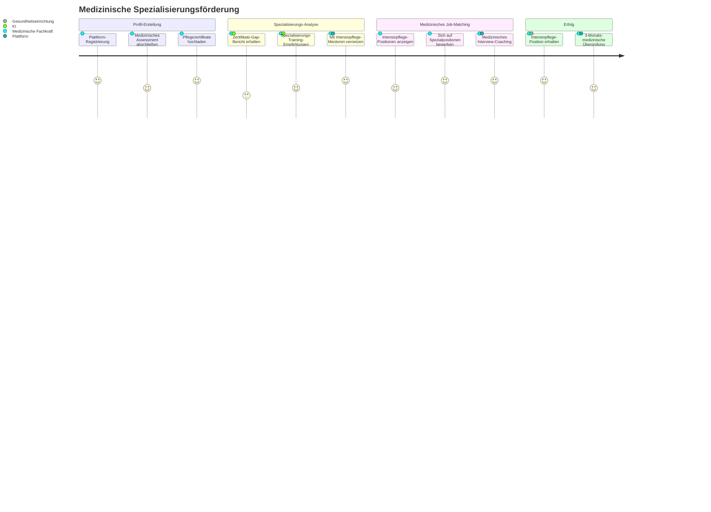

### Story 2: Erste medizinische Einstellung einer Privatpraxis
**Als** Privatpraxis-Inhaber bei meiner ersten medizinischen Assistenz-Einstellung  
**Möchte ich** Schweizer medizinische Arbeitsrechtsanforderungen verstehen und GAV-konforme Verträge erhalten  
**Damit** ich vertrauensvoll medizinisches Personal einstellen kann ohne regulatorische Risiken

<strong>🏥 Medizinische Compliance:</strong> Spezialisierte Beratung für Gesundheitseinrichtungs-Einstellungen mit GAV-Compliance und medizinischen Lizenzanforderungen.

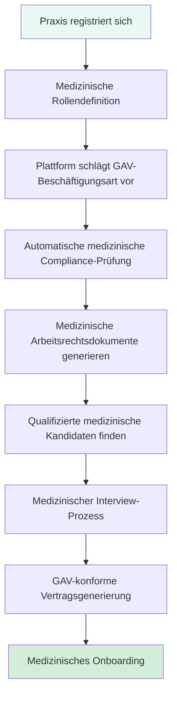

---

## 🟢 Differenzierungs-Stories

### Story 3: Smartes Gesundheitseinrichtungs-Matching
**Als** medizinische Fachkraft mit spezifischen Praxis-Präferenzen  
**Möchte ich** Gesundheitseinrichtungen finden, die zu meinem medizinischen Praxisstil und meinen Werten passen  
**Damit** ich nicht nur eine Position finde, sondern den richtigen medizinischen Umgebungs-Fit

<strong>🏥 Medizinisches Kultur-Matching:</strong> Gesundheitsspezifisches kulturelles Matching einschließlich Patientenbetreuungsphilosophie, medizinische Technologie-Präferenzen und Spezialisierungsfokus.

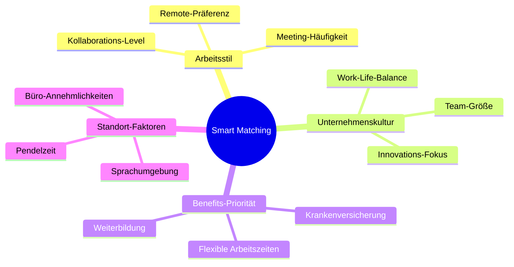

### Story 4: Mehrsprachige Stellenausschreibung
**Als** internationales Unternehmen in der Schweiz  
**Möchte ich** Stellenanzeigen gleichzeitig in mehreren Sprachen posten  
**Damit** ich vielfältige Talente aus allen Schweizer Sprachregionen anziehen kann

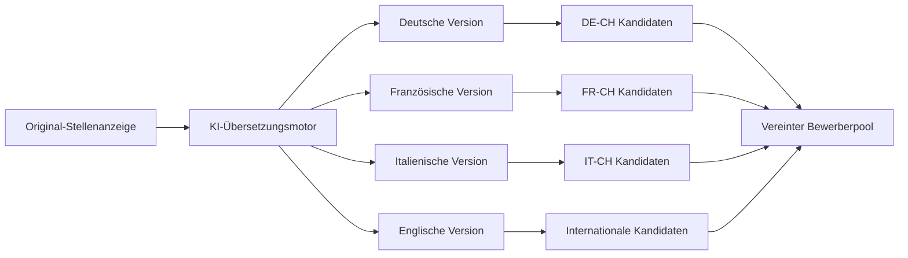

---

## 🟡 Pool Worker Innovation Stories

### Story 5: Flexible Medizinische Pool Worker
**Als** registrierte Krankenpflegerin bei BemedaPersonal mit flexiblen medizinischen Zeitwünschen  
**Möchte ich** meine Verfügbarkeits-Präferenzen setzen und zu passenden medizinischen Schichten mit GAV-Compliance gematcht werden  
**Damit** ich Work-Life-Balance aufrechterhalten kann und trotzdem beruflich aktiv in mehreren Gesundheitseinrichtungen bleibe

<strong>🏥 Medical Pool Worker Innovation:</strong> GAV-konforme flexible medizinische Beschäftigung mit Einsätzen in Krankenhäusern, Kliniken und spezialisierten Pflegeeinrichtungen.

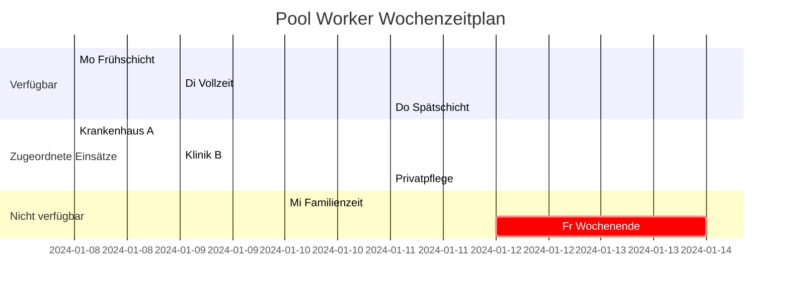

### Story 6: Medizinische Fachkraft Spezialisierungs-Aufbau
**Als** medizinische Fachkraft auf der Suche nach vielfältiger klinischer Erfahrung  
**Möchte ich** Einsätze in verschiedenen medizinischen Spezialisierungen und Gesundheitsumgebungen arbeiten  
**Damit** ich umfassende medizinische Erfahrung aufbauen und meine klinische Expertise erweitern kann

<strong>🏥 Medizinische Erfahrungs-Diversifikation:</strong> Klinische Einsätze in verschiedenen medizinischen Spezialisierungen zur umfassenden Gesundheitsexpertise-Entwicklung.

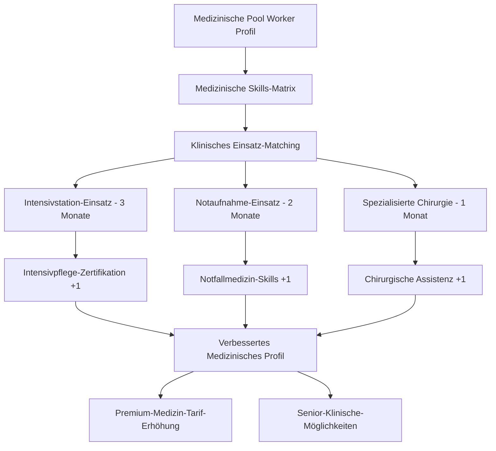

---

## 🟠 KI-basierte Intelligenz Stories

### Story 7: Prädiktive Medizinische Personal-Planung
**Als** Krankenhaus-HR-Direktor mit saisonalen Patientenaufkommen-Variationen  
**Möchte ich** Vorhersagen über zukünftige medizinische Personalbedürfnisse basierend auf Patientenaufnahme-Trends erhalten  
**Damit** ich medizinische Rekrutierungskampagnen proaktiv für Spitzenzeiten planen kann

<strong>🏥 Medizinische Workforce-Intelligence:</strong> Gesundheitsspezifische prädiktive Analytik unter Berücksichtigung von Patientenaufnahme-Mustern, saisonalen medizinischen Bedürfnissen und klinischen Spezialisierungsanforderungen.

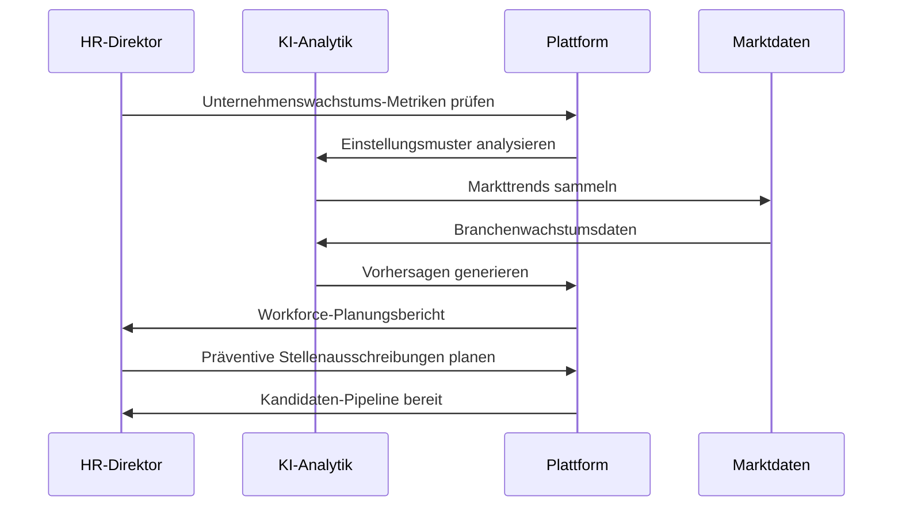

### Story 8: Skills-Evolution-Tracking
**Als** Fachkraft in einem sich schnell wandelnden Bereich  
**Möchte ich** Benachrichtigungen über aufkommende Skills in meiner Branche erhalten  
**Damit** ich wettbewerbsfähig und relevant im Arbeitsmarkt bleiben kann

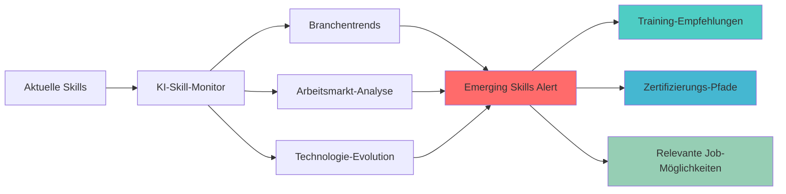

---

## 🔴 Premium-Services Stories

### Story 9: Executive Search mit Social Media Intelligence
**Als** Executive Search Berater  
**Möchte ich** Social Media Insights nutzen, um passive Kandidaten zu identifizieren und anzusprechen  
**Damit** ich Top-Talente finden kann, die nicht aktiv nach Jobs suchen

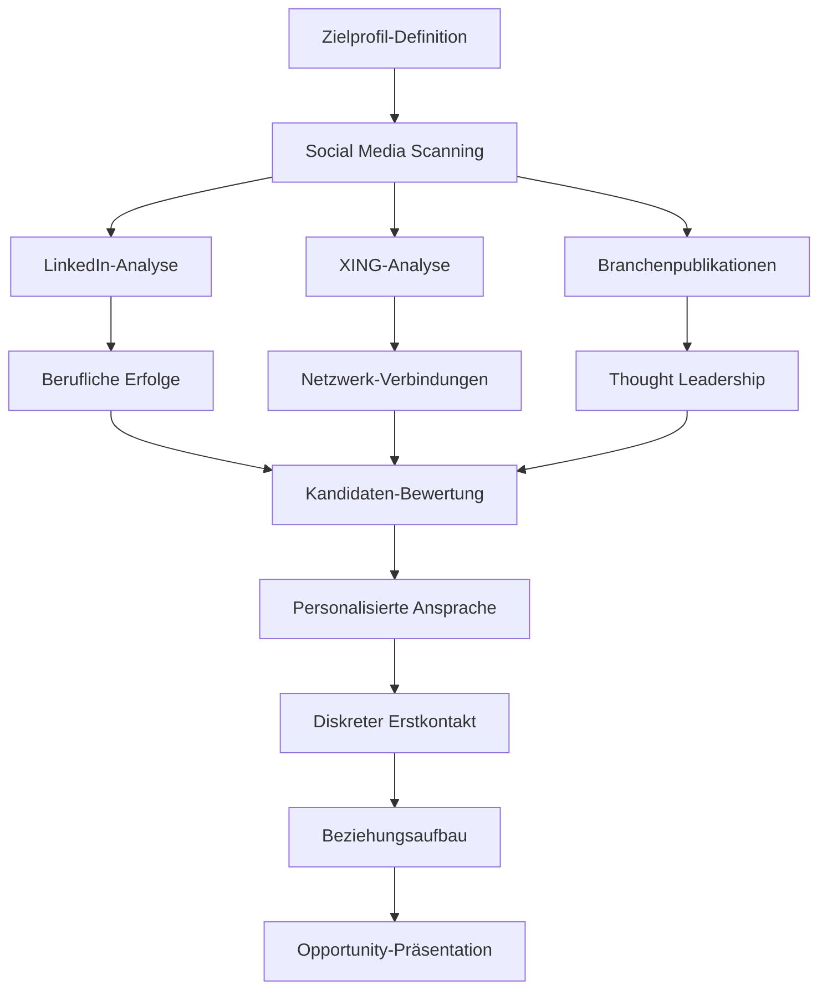

### Story 10: Compliance-Automatisierung für Großunternehmen
**Als** Schweizer HR-Manager eines multinationalen Konzerns  
**Möchte ich** Compliance-Prüfung bei allen Einstellungsprozessen automatisieren  
**Damit** ich 100% AVG-Compliance ohne manuelle Überwachung sicherstellen kann

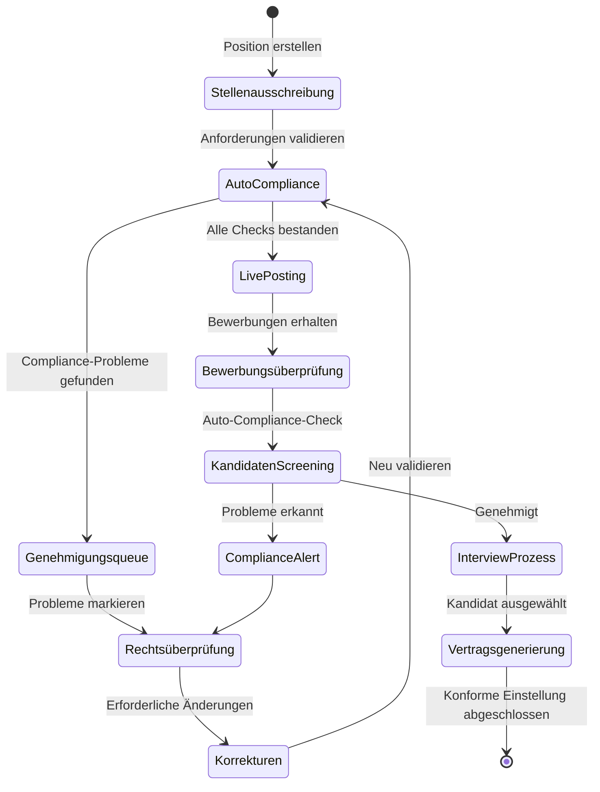

---

## 🚀 OOTB User Stories (Out of The Box)

### Story 11: Integrierte Social Media Medizin-Rekrutierung
**Als** Krankenhaus-HR-Direktor, der Top-Medizintalente anziehen möchte  
**Möchte ich**, dass BemedaPersonal unsere Social Media Rekrutierungskampagnen mit medizin-fokussierten Inhalten verwaltet  
**Damit** wir unsere Arbeitgebermarke aufbauen und passive medizinische Kandidaten durch gezielte soziale Medien anziehen können

<strong>🚀 Marketing-Agentur-Integration:</strong> Full-Service Social Media Rekrutierung, die medizinische Expertise mit professionellem Marketing kombiniert, um sich von traditionellen Personalagenturen zu differenzieren.

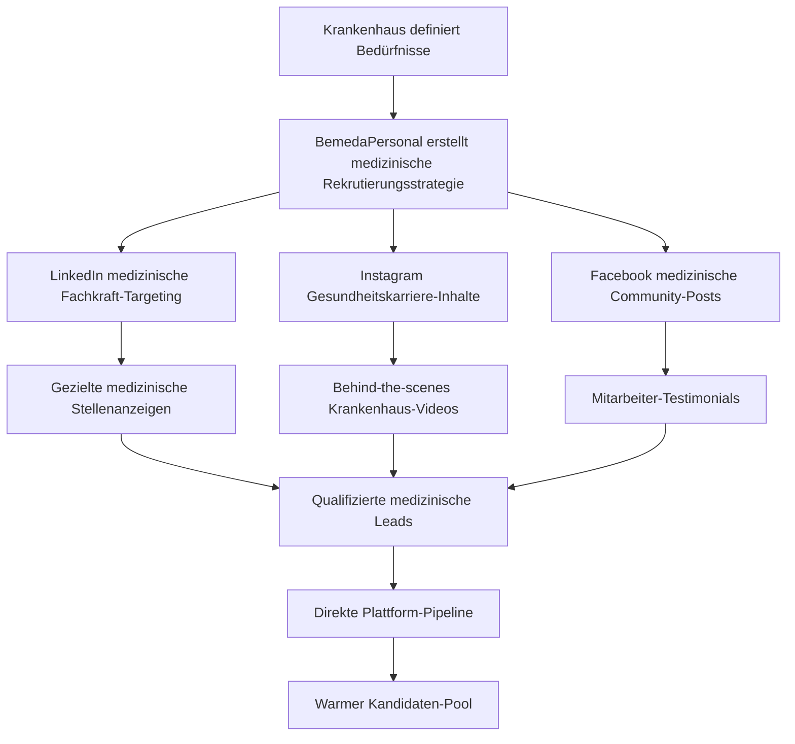

### Story 12: Professionelle Medizinische Rekrutierungsvideos
**Als** spezialisierte medizinische Klinik, die unsere Kultur zeigen möchte  
**Möchte ich**, dass BemedaPersonal professionelle Rekrutierungsvideos mit unserem Team und unseren Einrichtungen produziert  
**Damit** Kandidaten unsere Arbeitsumgebung und Kultur vor der Bewerbung sehen können

<strong>🚀 Video-Produktions-Service:</strong> Professionelle Video-Content-Erstellung als Mehrwert-Service, positioniert BemedaPersonal als Full-Service medizinischen Rekrutierungspartner.

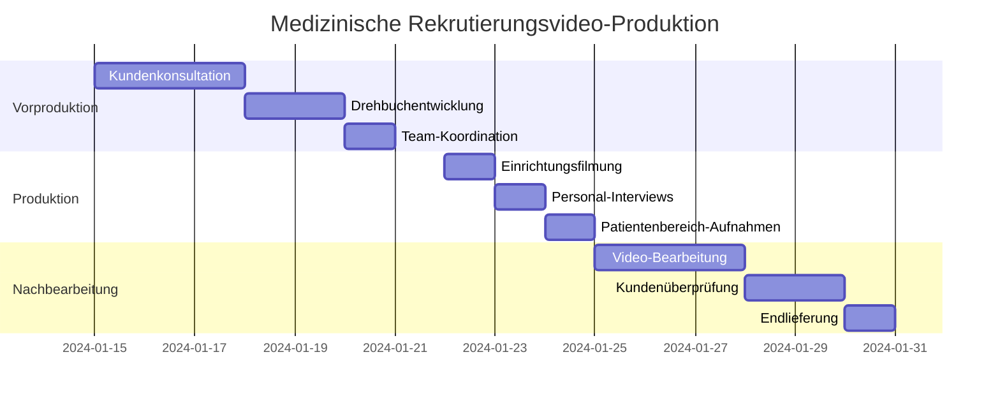

### Story 13: Medizinische Konferenz- & Event-Management
**Als** regionales Krankenhaus-Netzwerk, das eine medizinische Rekrutierungsveranstaltung plant  
**Möchte ich**, dass BemedaPersonal medizinische Karrieremessen und Networking-Events organisiert und verwaltet  
**Damit** wir potenzielle Kandidaten persönlich treffen und Beziehungen aufbauen können

<strong>🚀 Event-Management-Service:</strong> Full-Service medizinische Rekrutierungs-Event-Planung, schafft Networking-Möglichkeiten und positioniert BemedaPersonal als Gesundheitsbranchenführer.

### Story 14: Arbeitgeber-Branding & Content-Strategie
**Als** private medizinische Praxis, die unsere Online-Präsenz verbessern möchte  
**Möchte ich**, dass BemedaPersonal unsere Arbeitgebermarke mit professionellen Inhalten und Messaging entwickelt  
**Damit** wir bessere Kandidaten anziehen und mit größeren Institutionen konkurrieren können

<strong>🚀 Brand-Development-Service:</strong> Umfassendes Arbeitgeber-Branding speziell für medizinische Praxen, hilft kleineren Kliniken, mit großen Krankenhäusern um Talente zu konkurrieren.

### Story 15: KI-gestützte Marktintelligenz-Berichte
**Als** Krankenhaus-Führungskraft, die strategische Personalentscheidungen plant  
**Möchte ich**, dass BemedaPersonal maßgeschneiderte Marktintelligenz-Berichte über medizinische Einstellungstrends bereitstellt  
**Damit** ich datengestützte Entscheidungen über Vergütung, Einstellungszeitpunkt und Talent-Strategie treffen kann

<strong>🚀 Business Intelligence Service:</strong> Premium-Datenanalytik-Service mit medizinischen Arbeitsmarkt-Einblicken, etabliert BemedaPersonal als strategischen Partner statt nur Personaldienstleister.

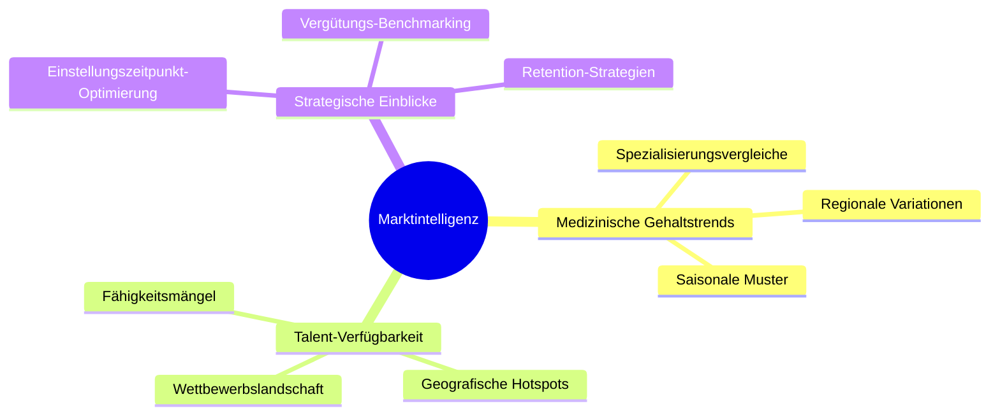

### Story 16: Integrierte Digitale Marketing-Kampagnen
**Als** medizinisches Zentrum, das eine neue Abteilung eröffnet  
**Möchte ich**, dass BemedaPersonal umfassende digitale Marketing-Kampagnen erstellt, die auf spezifische medizinische Spezialisierungen abzielen  
**Damit** wir unsere neue Abteilung schnell mit den richtigen Fachkräften besetzen können

<strong>🚀 Full-Service Marketing:</strong> End-to-End digitale Marketing-Kampagnen, die Rekrutierungs-Expertise mit professionellen Marketing-Agentur-Fähigkeiten kombinieren und einen Wettbewerbsgraben gegen traditionelle Personalvermittlung schaffen.

### Story 17: Employer Brand Storyteller Agentur
**Als** HR-Manager einer medizinischen Einrichtung  
**Möchte ich**, dass BemedaPersonal eine überzeugende und authentische Arbeitgebermarke durch spezialisierte Inhalte aufbaut  
**Damit** wir Top-Medizintalente aktiv anziehen und langfristig binden können

<strong>🚀 Employer Brand Storytelling:</strong> Umfassendes Arbeitgeber-Branding einschließlich Videoproduktion, Content-Marketing und gezielten Social Media Kampagnen für medizinische Institutionen.

**Services Umfassen:**
- **Spezialisierte Employer Branding Videos**: "Ein Tag bei uns", Mitarbeiter-Testimonials, Team-Events zur Darstellung der medizinischen Kultur
- **Content-Marketing für Arbeitgebermarken**: Blog-Artikel, Infografiken, Social Media Content zur Hervorhebung von Werten und Karrierechancen
- **Zielgruppen-spezifische Social Media Kampagnen**: LinkedIn, Instagram, TikTok Kampagnen auf spezifische medizinische Spezialisierungen zugeschnitten

### Story 18: Talent Pipeline Strategist
**Als** CEO einer Gesundheitsorganisation  
**Möchte ich** proaktiv einen Pool qualifizierter medizinischer Talente aufbauen und strategische Markteinblicke erhalten  
**Damit** ich zukünftige Wachstumsziele sicherstelle, anstatt nur auf offene Stellen zu reagieren

<strong>🚀 Strategische Talent-Intelligence:</strong> Proaktives Talent-Pipelining mit Marktanalysen und Future-Skills-Beratung für Gesundheitsführung.

**Services Umfassen:**
- **Proaktives Talent-Pipelining**: Beziehungsaufbau zu potenziellen medizinischen Kandidaten bevor Stellen vakant werden
- **Markt- und Gehaltsanalysen**: Detaillierte Berichte über medizinische Talentverfügbarkeit, Gehaltsbenchmarks, Wettbewerbsaktivitäten
- **Future-Skills-Consulting**: Beratung über entscheidende medizinische Fähigkeiten in den nächsten 3-5 Jahren

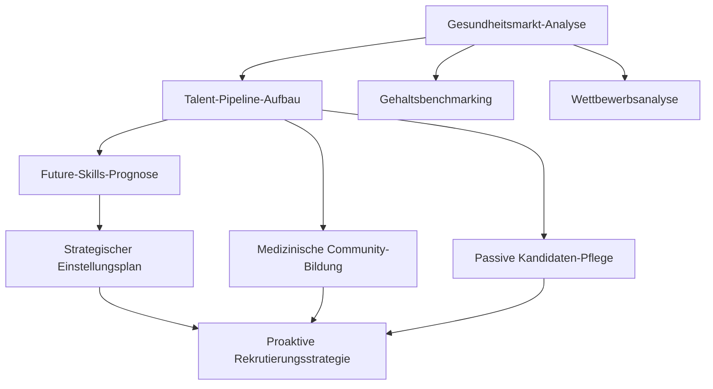

### Story 19: Candidate Experience Optimierer
**Als** HR-Manager im Gesundheitswesen  
**Möchte ich** sicherstellen, dass jeder medizinische Kandidat eine herausragende personalisierte Erfahrung macht, unabhängig vom Ergebnis  
**Damit** wir unseren Ruf stärken und positive Mundpropaganda in der medizinischen Gemeinschaft fördern

<strong>🚀 Medizinische Candidate Experience:</strong> End-to-End Kandidaten-Journey-Optimierung speziell für Gesundheitsfachkräfte mit Bemeda Academy Integration.

**Services Umfassen:**
- **Personalisierte Kandidaten-Journeys**: Jeder Kontaktpunkt für medizinische Fachkräfte optimiert
- **Pre-Boarding Support**: Welcome-Videos, Infopakete, virtuelle Team-Vorstellungen
- **Bemeda Academy Integration**: Kontinuierliche Lernmöglichkeiten während des Rekrutierungsprozesses
- **Feedback-Schleifen & Analyse**: Systematische Sammlung und Analyse von medizinischen Kandidaten-Feedback

### Story 20: Passives Medizin-Talent Targeting via LinkedIn
**Als** Klinik-HR-Manager  
**Möchte ich** automatisierte LinkedIn-Kampagnen für passive medizinische Kandidaten mit DSG-konformem Consent-Management  
**Damit** ich versteckte medizinische Talente erreiche und die Einstellungszeit um 30% reduziere

<strong>🚀 Schweizer Compliance Innovation:</strong> LinkedIn-Automatisierung mit FMH-Register-Integration und vollständigen AVG-Audit-Trails für medizinisches Fachkraft-Targeting.

**Akzeptanzkriterien:**
- DSG-konformes Consent-Management integriert
- FMH-Register-Verifikation für Credential-Checks
- Vollständiger Audit-Trail für AVG-Transparenz
- 40% Zugang zu passiven medizinischen Fachkräften vs. traditionelle Agenturen

### Story 21: Medizinische Influencer-Partnerschaften
**Als** medizinische PoolWorker (registrierte Krankenpflegerin)  
**Möchte ich** über die Plattform mit medizinischen Influencern für authentische Karriere-Insights vernetzt werden  
**Damit** ich engagiert und loyal zur BemedaPersonal-Community bleibe

<strong>🚀 Medizinische Community-Bildung:</strong> Partnerschaften mit Schweizer medizinischen Influencern und Bemeda Academy Thought Leaders für erhöhte Retention und berufliche Entwicklung.

**Services Umfassen:**
- Partnerschaften mit GAV-konformen medizinischen Influencern
- Bemeda Academy expertengeführte Webinare und Inhalte
- 25% erhöhte Retention durch Community-Building

### Story 22: KI-generierte Medizinische Einrichtungs-Promo-Videos
**Als** Krankenhaus-Administrator  
**Möchte ich** templatierte, KI-erstellte Promo-Videos für Stellenausschreibungen hochladen  
**Damit** ich Kandidaten virtuell unsere Arbeitsumgebung zeige und Bewerbungen um 50% steigere

<strong>🚀 KI-Video-Innovation:</strong> Kosteneffiziente, personalisierte Video-Content-Erstellung mit kantonaler GAV-Compliance und internationaler Talent-Anziehung.

**Features:**
- Kantonal GAV-spezifische Video-Templates
- DSG-konforme Einrichtungsaufnahmen
- Internationale Talent-Anziehung (B/L-Permit-Integration)
- Bemeda Academy Produktions-Training für Klienten

### Story 23: KI-gestützte PoolWorker Zeitplan-Optimierung
**Als** medizinische PoolWorker mit spezifischen Verfügbarkeitspräferenzen  
**Möchte ich** meinen persönlichen Arbeitsplan hochladen und automatisierte "Einsatz"-Füllung basierend auf meinem Zeitplan erhalten  
**Damit** ich meine Arbeitszeiten maximieren kann und gleichzeitig Work-Life-Balance aufrechterhalte

<strong>🤖 KI-Zeitplan-Intelligence:</strong> Erweiterte Kalender-Integration mit prädiktivem Einsatz-Matching, optimiert PoolWorker-Auslastung unter Berücksichtigung persönlicher Präferenzen und GAV-Arbeitszeitvorschriften.

**KI-Features:**
- **Smart Kalender-Integration**: Upload von Google/Outlook-Kalendern für automatische Verfügbarkeitserkennung
- **Prädiktives Einsatz-Matching**: KI schlägt optimale "Einsätze" basierend auf Fähigkeiten, Standort und Zeitplan-Lücken vor
- **GAV-Arbeitszeit-Compliance**: Automatische Durchsetzung der Schweizer Arbeitszeitvorschriften
- **Pendel-Optimierung**: KI berücksichtigt Reisezeit und öffentliche Verkehrsverbindungen
- **Präferenz-Lernen**: System lernt aus Annahme-/Ablehnungsmustern zur Verbesserung der Vorschläge

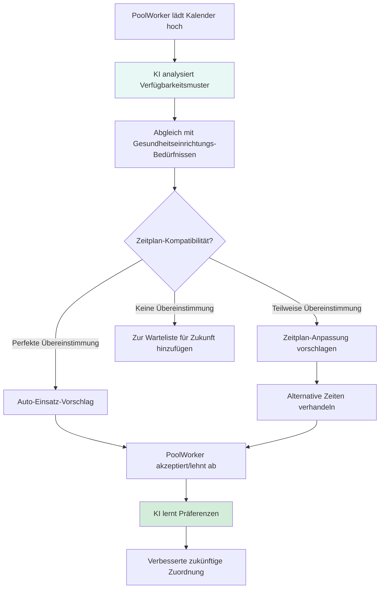

**Vorteile:**
- 70% Erhöhung der PoolWorker-Auslastungsraten
- 85% Reduktion der manuellen Planungszeit
- 90% Einsatz-Akzeptanzrate durch smartes Matching

### Story 24: Integrierte Wohnlösungen für Internationale Medizinische Fachkräfte
**Als** internationale medizinische Fachkraft, die in die Schweiz umzieht  
**Möchte ich**, dass BemedaPersonal temporäre und permanente Wohnlösungen organisiert  
**Damit** ich mich auf meine medizinische Laufbahn konzentrieren kann ohne Wohnungsstress während der Umsiedelung

<strong>🏠 Umzugsdienst-Integration:</strong> End-to-End Wohnungsunterstützung für internationale medizinische Talente, beseitigt Barrieren für Schweizer Gesundheitsrekrutierung und gewährleistet reibungslose Integration.

**Wohnungsservices Umfassen:**
- **Temporäre Unterkunft**: Partner-Netzwerk von medizinischen Fachkraft-Wohnungen für erste 1-3 Monate
- **Permanente Wohnungssuche**: KI-gestützte Wohnung/Haus-Zuordnung basierend auf Arbeitsplatz-Standort und Budget
- **Kantonale Integration**: Standort-spezifische Beratung für jeden Schweizer Kanton-Wohnungsmarkt
- **Rechtliche Unterstützung**: Mietvertrags-Hilfe und Schweizer Mieterrechts-Bildung
- **Community-Integration**: Verbindung mit lokalen medizinischen Fachkraft-Netzwerken

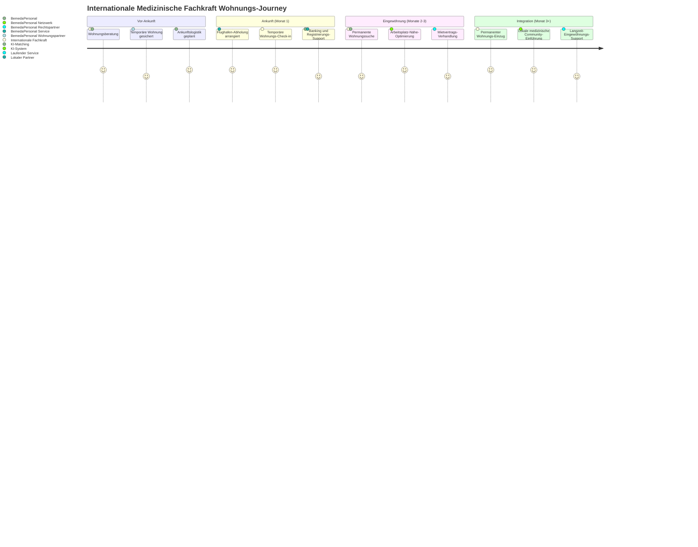

**Partner-Netzwerk:**
- **Temporäre Wohnungspartner**: Serviced Apartments, medizinische Fachkraft-Residenzen
- **Immobilien-Partnerschaften**: Spezialisierte Agenten für medizinische Fachkraft-Wohnungen
- **Rechtsdienstleistungen**: Einwanderungs- und Wohnungsrechts-Spezialisten
- **Umzugsdienste**: Professionelle Umzugs- und Setup-Hilfe
- **Community-Netzwerke**: Medizinische Fachkraft-Sozial- und Networking-Gruppen

**Erfolgskennzahlen:**
- 95% erfolgreiche Wohnungsplatzierung innerhalb 30 Tagen
- 80% Übergang von temporärer zu permanenter Wohnung innerhalb 3 Monaten
- 90% Zufriedenheitsrate mit Wohnungslösungen
- 60% schnellere Integration in Schweizer medizinische Gemeinschaft

---

## 🎯 Wettbewerbsdifferenzierungs-Szenarien

### Szenario 1: "Sofort-Pool Worker Response"
**Traditionelles Problem**: Dringende Personalbedürfnisse dauern Tage zur Lösung  
**BemedaPersonal-Lösung**: Echtzeit-Pool Worker Benachrichtigung mit 15-Minuten-Response-Zusage

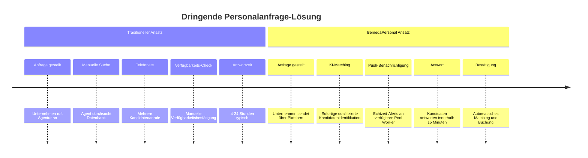

### Szenario 2: "Karrierewege-Optimierung"
**Traditionelles Problem**: Arbeitssuchende treffen Karriereentscheidungen ohne strategische Führung  
**BemedaPersonal-Lösung**: KI-basierte Karrierewege-Optimierung mit Gehaltsvorhersage

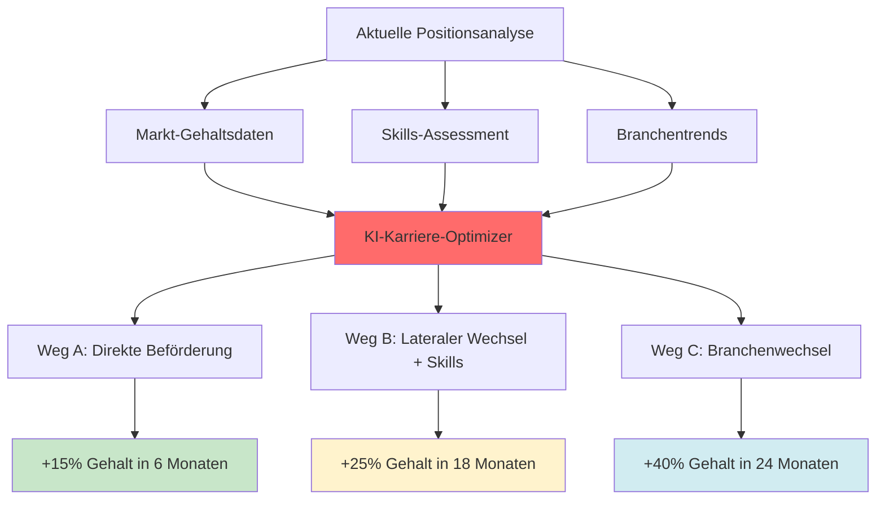

### Szenario 3: "Schweizer Compliance-Garantie"
**Traditionelles Problem**: Unternehmen riskieren Non-Compliance mit komplexem Schweizer Arbeitsrecht  
**BemedaPersonal-Lösung**: 100% Compliance-Garantie mit Rechtsversicherungs-Backing

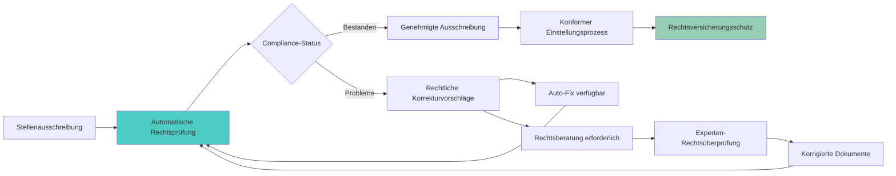

---

## 📊 Erfolgs-Metriken für User Stories

### Engagement-Metriken
- **Story-Abschlussrate**: 95%+ Benutzer schließen ihre primäre Journey ab
- **Feature-Adoption**: 80%+ Benutzer nutzen Differenzierungs-Features
- **Pool Worker Auslastung**: 70%+ Pool Worker monatlich aktiv

### Zufriedenheits-Metriken  
- **Net Promoter Score**: Ziel 70+ bei allen Benutzertypen
- **Erfolgsrate**: 90%+ erfolgreiche Vermittlungen schließen Probezeit ab
- **Antwortzeit**: <15 Minuten für dringende Pool Worker Anfragen

### Business-Impact-Metriken
- **Umsatz pro Benutzer**: 25% höher als traditionelle Plattformen
- **Compliance-Score**: 100% Audit-Erfolgsrate
- **Marktdifferenzierung**: 40% der Kunden nennen einzigartige Features als Entscheidungsfaktor

---

## 🔄 Story-Implementierungs-Priorität

### Phase 1: Grundlage (Monate 1-6)
- Kern-Plattform Stories (Stories 1-2)
- Basis Pool Worker Funktionalität (Story 5)
- Wesentliche Compliance-Features (Story 10 Grundlage)

### Phase 2: Differenzierung (Monate 7-12)
- Smart Matching und kultureller Fit (Story 3)
- Mehrsprachige Fähigkeiten (Story 4)
- Erweiterte Pool Worker Features (Story 6)

### Phase 3: Intelligenz (Monate 13-18)
- KI-basierte Workforce-Planung (Story 7)
- Skills-Evolution-Tracking (Story 8)
- Executive Search Fähigkeiten (Story 9)

### Phase 4: Marktführerschaft (Monate 19-24)
- Vollständige Premium-Services-Suite
- Komplette Wettbewerbsdifferenzierung
- Erweiterte Compliance-Automatisierung

---

*Diese User Stories definieren die menschliche Erfahrung, die BemedaPersonal zur definitiven Plattform für Schweizer Personaldienstleistungen machen wird, indem sie innovative Technologie mit tiefem Marktverständnis kombinieren.*