# User Stories

## Überblick

User Stories erfassen die menschliche Erfahrung und das Wertversprechen von BemedaPersonal aus allen Stakeholder-Perspektiven. Diese Stories zeigen innovative Features auf, die uns von traditionellen Recruitment-Plattformen unterscheiden und unser Pool Worker System, KI-basiertes Matching und umfassenden Schweizer Compliance-Ansatz hervorheben.

---

## Story-Kategorien

### 🔵 Kern-Plattform Stories
Wesentliche Funktionalität für grundlegende Operationen

### 🟢 Differenzierungs-Stories  
Innovative Features, die uns von Wettbewerbern abheben

### 🟡 Pool Worker Innovation
Workforce-Management der nächsten Generation mit Flexibilität

### 🟠 KI-basierte Intelligenz
Smartes Matching und prädiktive Fähigkeiten

### 🔴 Premium-Services
Hochwertige Services für Enterprise-Kunden

---

## 🔵 Kern-Plattform Stories

### Story 1: Karrierewechsel einer Fachkraft
**Als** Gesundheitsfachkraft, die in die IT wechseln möchte  
**Möchte ich** personalisierte Karrierewechsel-Beratung und Skill-Gap-Analyse erhalten  
**Damit** ich erfolgreich in eine neue Branche wechseln kann mit Vertrauen

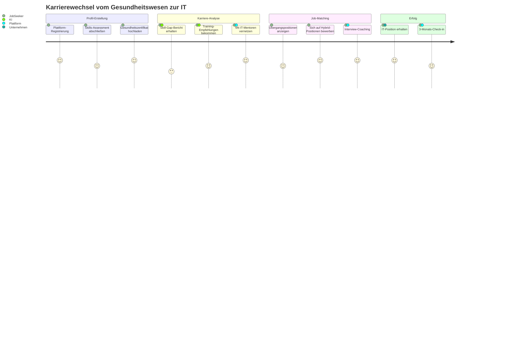

### Story 2: Erste Einstellung eines Kleinunternehmens
**Als** Startup-Gründer bei meiner ersten Einstellung  
**Möchte ich** Schweizer Arbeitsrechtsanforderungen verstehen und konforme Verträge erhalten  
**Damit** ich vertrauensvoll einstellen kann ohne rechtliche Risiken

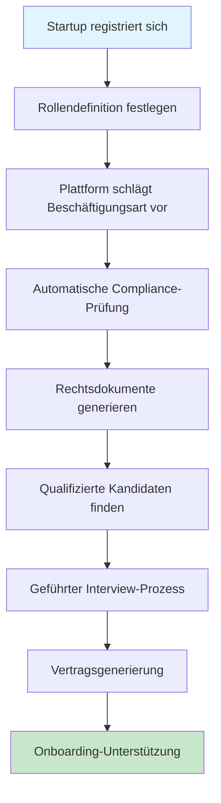

---

## 🟢 Differenzierungs-Stories

### Story 3: Smartes Unternehmens-Matching
**Als** Arbeitssuchender mit spezifischen kulturellen Präferenzen  
**Möchte ich** Unternehmen finden, die zu meinem Arbeitsstil und meinen Werten passen  
**Damit** ich nicht nur einen Job finde, sondern den richtigen kulturellen Fit

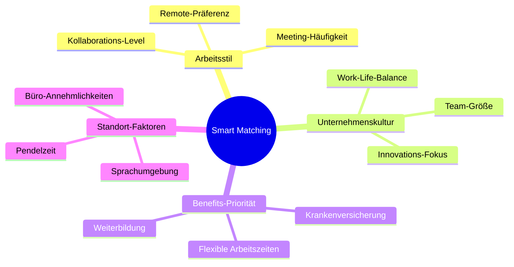

### Story 4: Mehrsprachige Stellenausschreibung
**Als** internationales Unternehmen in der Schweiz  
**Möchte ich** Stellenanzeigen gleichzeitig in mehreren Sprachen posten  
**Damit** ich vielfältige Talente aus allen Schweizer Sprachregionen anziehen kann

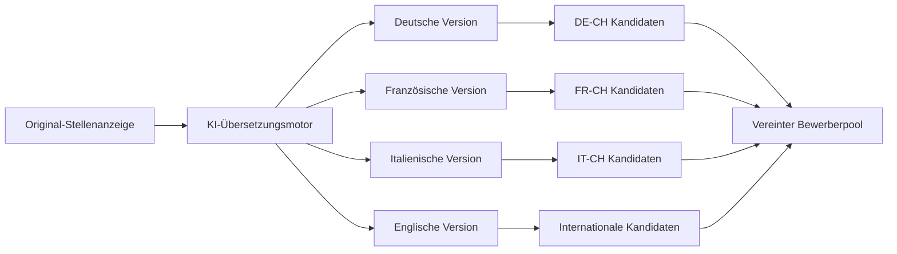

---

## 🟡 Pool Worker Innovation Stories

### Story 5: Flexible Gesundheitsfachkraft
**Als** registrierte Krankenpflegerin mit flexiblen Zeitwünschen  
**Möchte ich** meine Verfügbarkeits-Präferenzen setzen und zu passenden Schichten gematcht werden  
**Damit** ich Work-Life-Balance aufrechterhalten kann und trotzdem beruflich aktiv bleibe

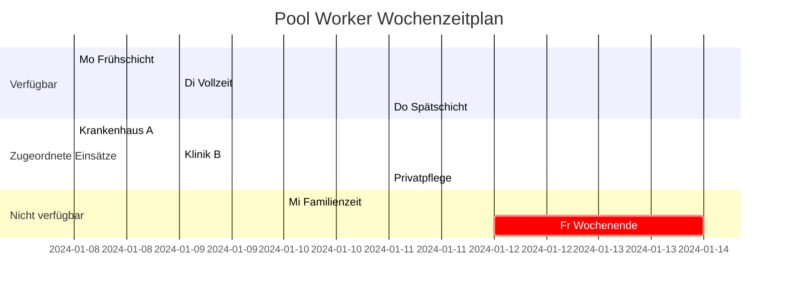

### Story 6: IT-Contractor Portfolio-Aufbau
**Als** IT-Contractor auf der Suche nach vielfältiger Erfahrung  
**Möchte ich** an Projekten in verschiedenen Branchen und Technologien arbeiten  
**Damit** ich ein starkes Portfolio aufbauen und meine Fähigkeiten erweitern kann

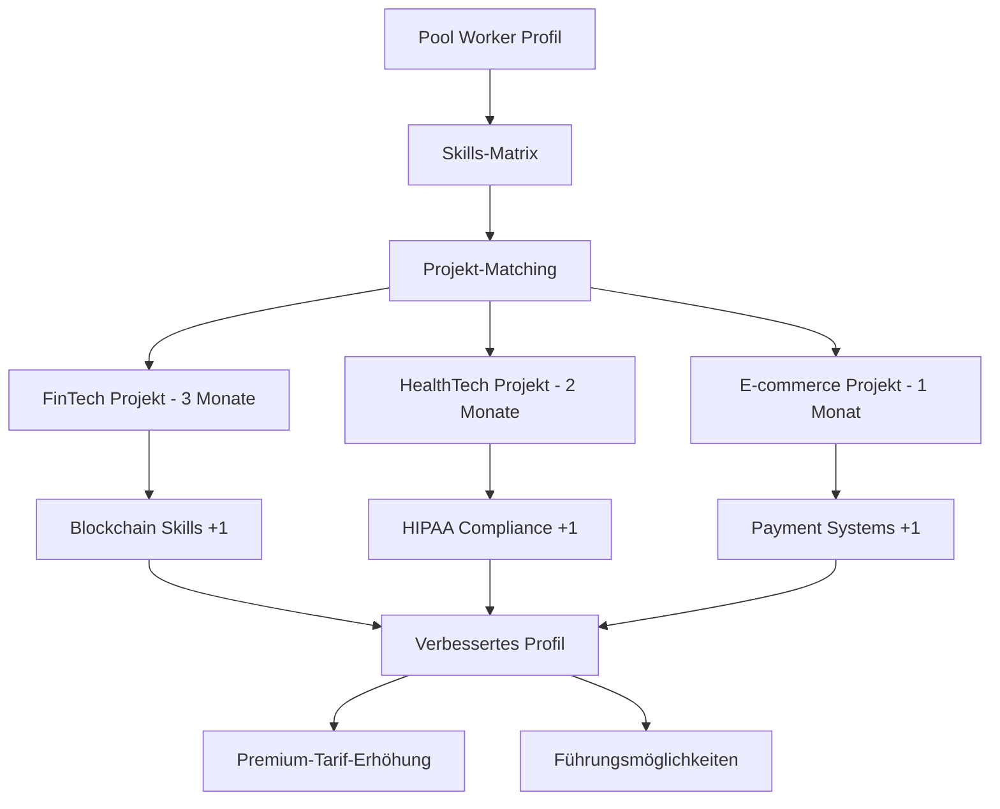

---

## 🟠 KI-basierte Intelligenz Stories

### Story 7: Prädiktive Workforce-Planung
**Als** HR-Direktor eines wachsenden Unternehmens  
**Möchte ich** Vorhersagen über zukünftige Einstellungsbedürfnisse basierend auf Geschäftstrends erhalten  
**Damit** ich Rekrutierungskampagnen proaktiv planen kann

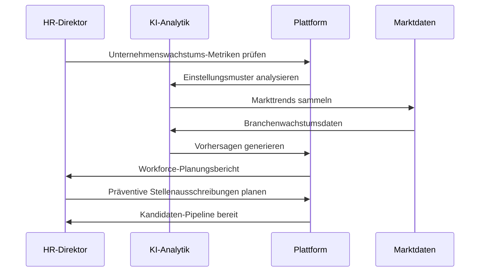

### Story 8: Skills-Evolution-Tracking
**Als** Fachkraft in einem sich schnell wandelnden Bereich  
**Möchte ich** Benachrichtigungen über aufkommende Skills in meiner Branche erhalten  
**Damit** ich wettbewerbsfähig und relevant im Arbeitsmarkt bleiben kann

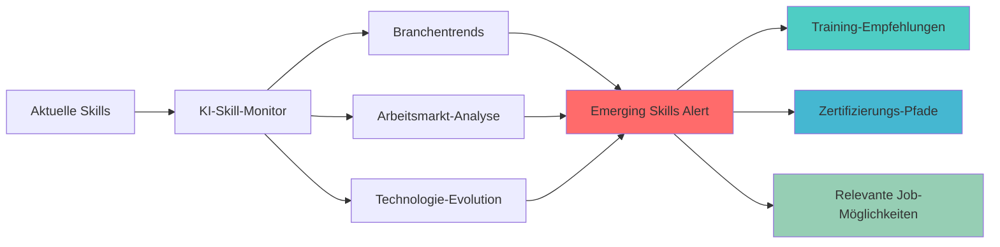

---

## 🔴 Premium-Services Stories

### Story 9: Executive Search mit Social Media Intelligence
**Als** Executive Search Berater  
**Möchte ich** Social Media Insights nutzen, um passive Kandidaten zu identifizieren und anzusprechen  
**Damit** ich Top-Talente finden kann, die nicht aktiv nach Jobs suchen

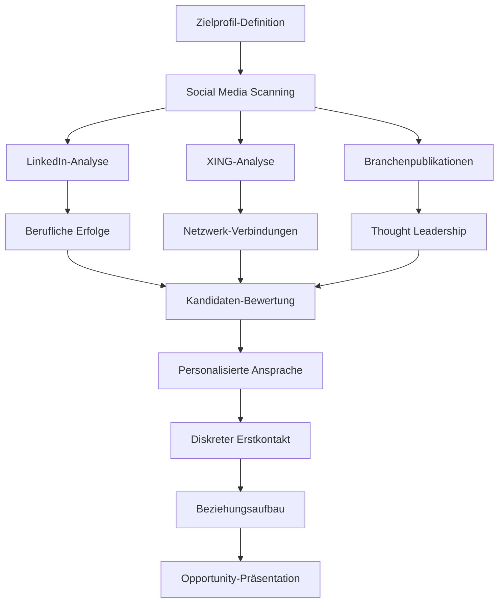

### Story 10: Compliance-Automatisierung für Großunternehmen
**Als** Schweizer HR-Manager eines multinationalen Konzerns  
**Möchte ich** Compliance-Prüfung bei allen Einstellungsprozessen automatisieren  
**Damit** ich 100% AVG-Compliance ohne manuelle Überwachung sicherstellen kann

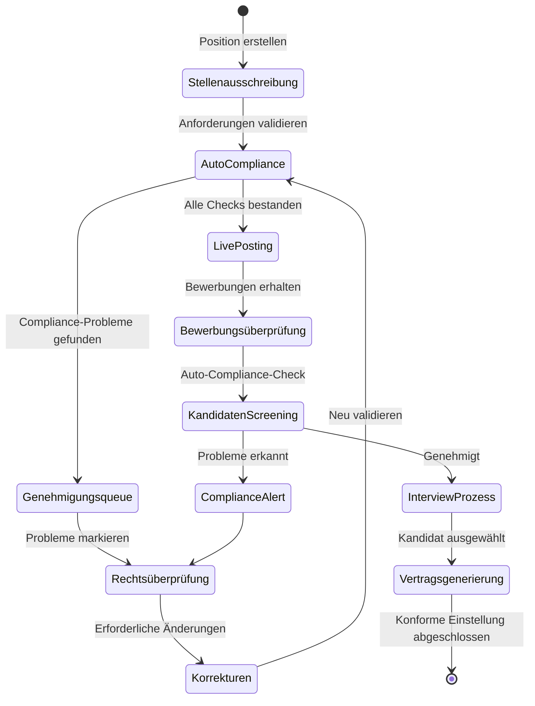

---

## 🎯 Wettbewerbsdifferenzierungs-Szenarien

### Szenario 1: "Sofort-Pool Worker Response"
**Traditionelles Problem**: Dringende Personalbedürfnisse dauern Tage zur Lösung  
**BemedaPersonal-Lösung**: Echtzeit-Pool Worker Benachrichtigung mit 15-Minuten-Response-Zusage

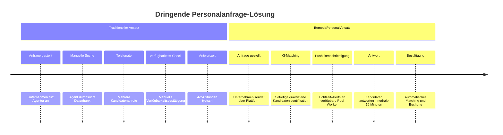

### Szenario 2: "Karrierewege-Optimierung"
**Traditionelles Problem**: Arbeitssuchende treffen Karriereentscheidungen ohne strategische Führung  
**BemedaPersonal-Lösung**: KI-basierte Karrierewege-Optimierung mit Gehaltsvorhersage

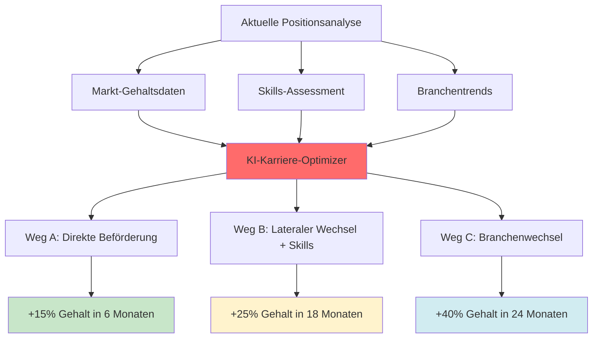

### Szenario 3: "Schweizer Compliance-Garantie"
**Traditionelles Problem**: Unternehmen riskieren Non-Compliance mit komplexem Schweizer Arbeitsrecht  
**BemedaPersonal-Lösung**: 100% Compliance-Garantie mit Rechtsversicherungs-Backing

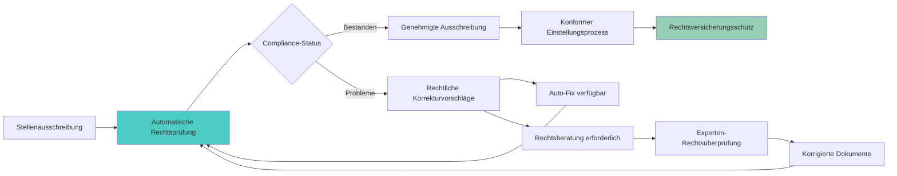

---

## 📊 Erfolgs-Metriken für User Stories

### Engagement-Metriken
- **Story-Abschlussrate**: 95%+ Benutzer schließen ihre primäre Journey ab
- **Feature-Adoption**: 80%+ Benutzer nutzen Differenzierungs-Features
- **Pool Worker Auslastung**: 70%+ Pool Worker monatlich aktiv

### Zufriedenheits-Metriken  
- **Net Promoter Score**: Ziel 70+ bei allen Benutzertypen
- **Erfolgsrate**: 90%+ erfolgreiche Vermittlungen schließen Probezeit ab
- **Antwortzeit**: <15 Minuten für dringende Pool Worker Anfragen

### Business-Impact-Metriken
- **Umsatz pro Benutzer**: 25% höher als traditionelle Plattformen
- **Compliance-Score**: 100% Audit-Erfolgsrate
- **Marktdifferenzierung**: 40% der Kunden nennen einzigartige Features als Entscheidungsfaktor

---

## 🔄 Story-Implementierungs-Priorität

### Phase 1: Grundlage (Monate 1-6)
- Kern-Plattform Stories (Stories 1-2)
- Basis Pool Worker Funktionalität (Story 5)
- Wesentliche Compliance-Features (Story 10 Grundlage)

### Phase 2: Differenzierung (Monate 7-12)
- Smart Matching und kultureller Fit (Story 3)
- Mehrsprachige Fähigkeiten (Story 4)
- Erweiterte Pool Worker Features (Story 6)

### Phase 3: Intelligenz (Monate 13-18)
- KI-basierte Workforce-Planung (Story 7)
- Skills-Evolution-Tracking (Story 8)
- Executive Search Fähigkeiten (Story 9)

### Phase 4: Marktführerschaft (Monate 19-24)
- Vollständige Premium-Services-Suite
- Komplette Wettbewerbsdifferenzierung
- Erweiterte Compliance-Automatisierung

---

*Diese User Stories definieren die menschliche Erfahrung, die BemedaPersonal zur definitiven Plattform für Schweizer Personaldienstleistungen machen wird, indem sie innovative Technologie mit tiefem Marktverständnis kombinieren.*