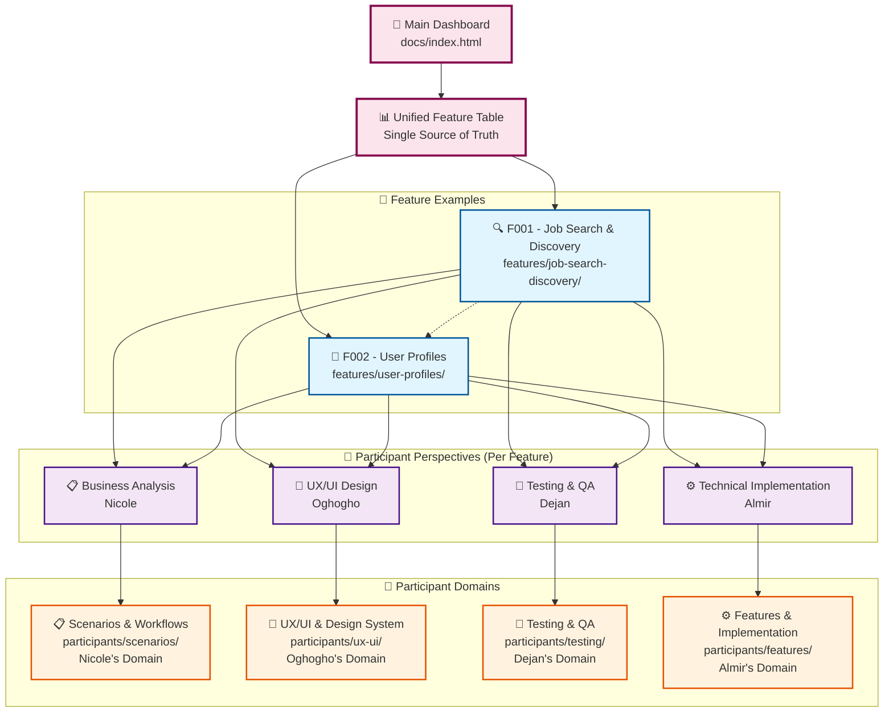
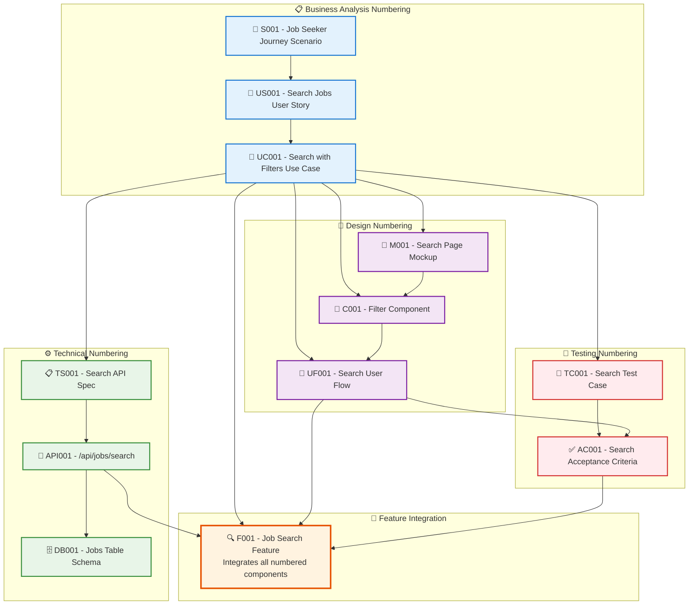
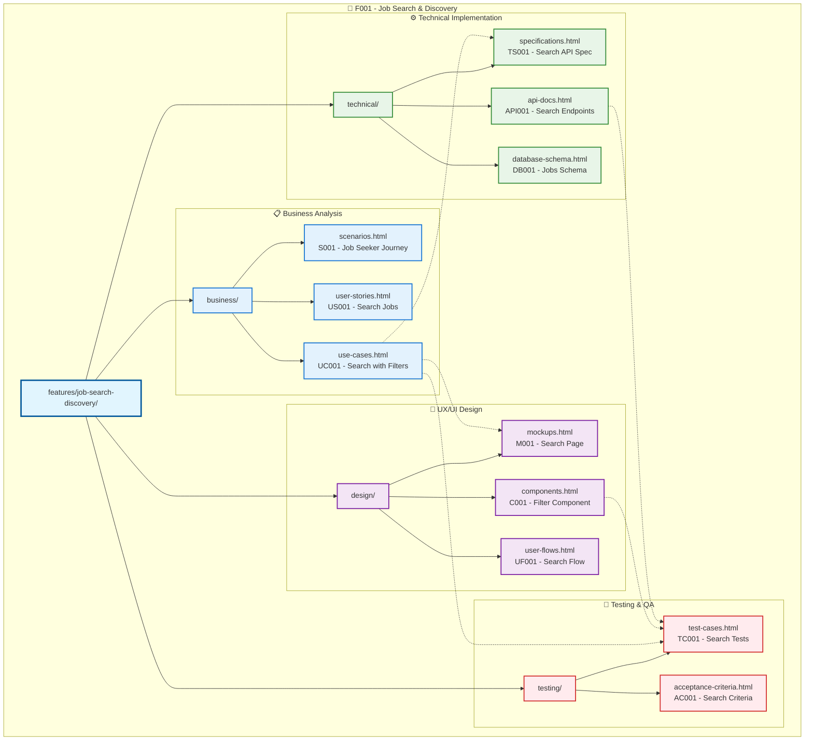
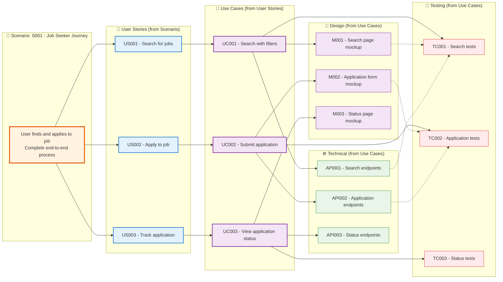
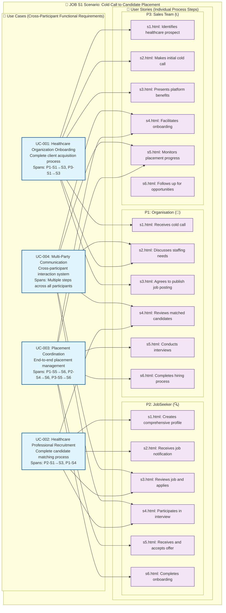
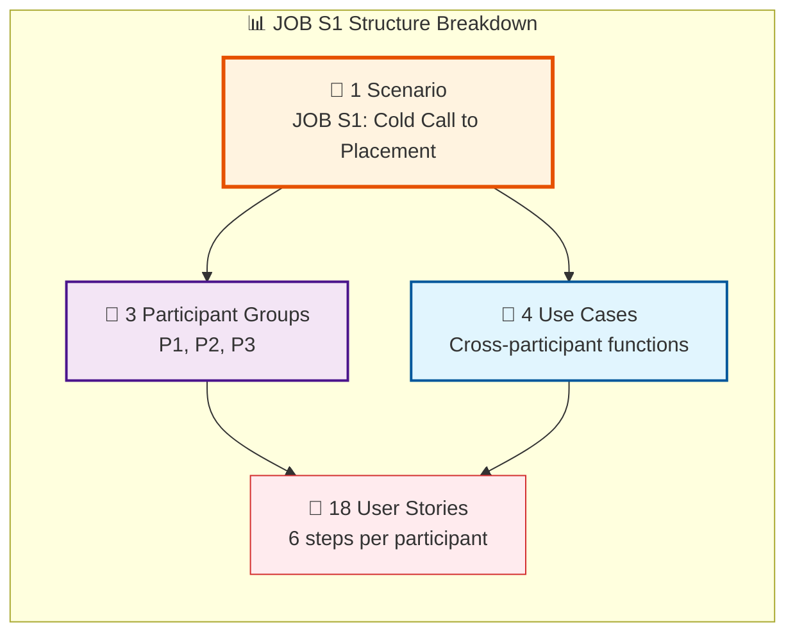
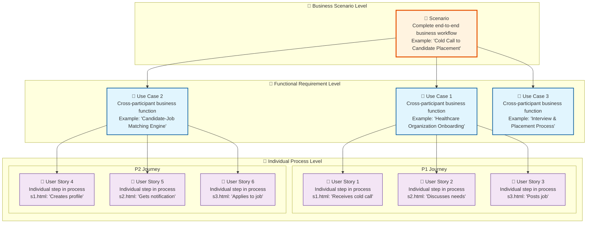
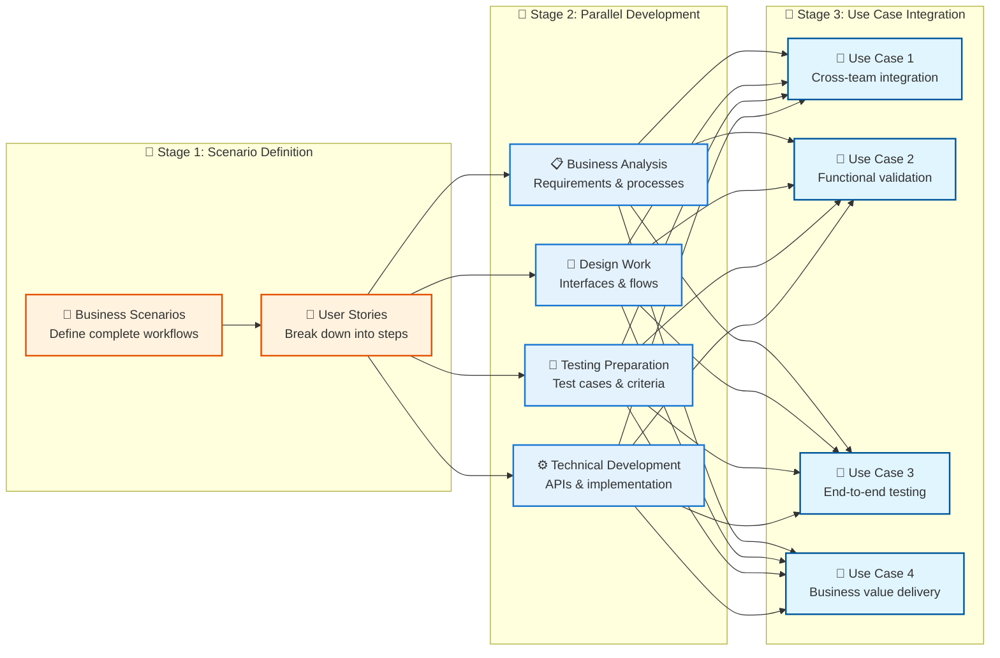
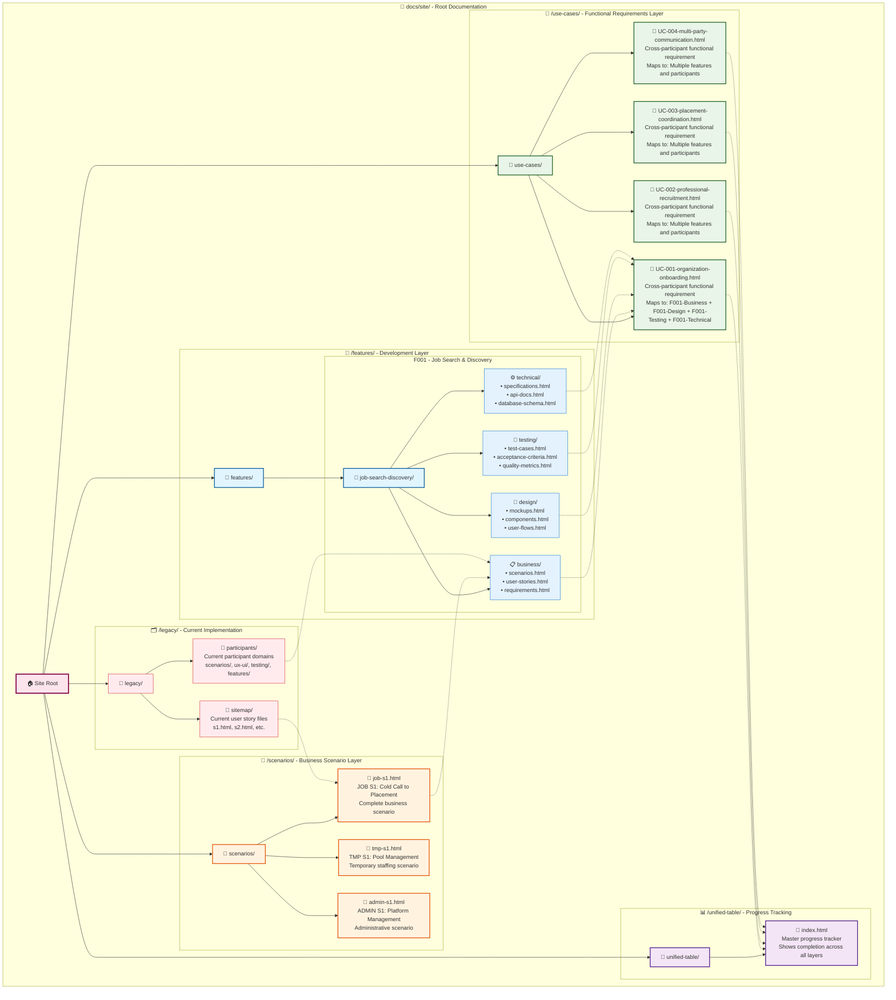

# Bemeda Platform Documentation Structure - Conceptual Overview

## 🎯 **Simplified Structure Overview**



## 📋 **How Scenarios, User Cases, and Features Connect**

```mermaid
graph LR
    subgraph "📋 Business Analysis Layer (Nicole)"
        SCENARIO1[📖 Scenario: Job Seeker Journey<br/>S001 - User finds and applies to job]
        USERSTORY1[👤 User Story: US001<br/>"As a job seeker, I want to search for jobs<br/>so that I can find relevant opportunities"]
        USECASE1[🎯 Use Case: UC001<br/>"Search Jobs with Filters"]
    end
    
    subgraph "🎨 Design Layer (Oghogho)"
        mess<br/>UF001 - Search interaction flow]
    end
    
    subgraph "🐛 Testing Layer (Dejan)"
        TESTCASE1[🧪 Test Case: TC001<br/>"Search functionality with filters"]
        ACCEPTANCE1[✅ Acceptance Criteria<br/>AC001 - Search requirements]
    end
    
    subgraph "⚙️ Technical Layer (Almir)"
        SPEC1[📋 Technical Spec: TS001<br/>"Search API specification"]
        API1[🔌 API: Search Endpoints<br/>API001 - /api/jobs/search]
        DB1[🗄️ Database: Job Schema<br/>DB001 - jobs table]
    end
    
    %% How they connect to the feature
    subgraph "🎯 Feature: F001 - Job Search & Discovery"
        FEATURE1[🔍 Job Search Feature<br/>All components working together]
    end
    
    %% Business Analysis connections
    SCENARIO1 --> USERSTORY1
    USERSTORY1 --> USECASE1
    USECASE1 --> FEATURE1
    
    %% Design connections
    USECASE1 --> MOCKUP1
    MOCKUP1 --> COMPONENT1
    COMPONENT1 --> USERFLOW1
    USERFLOW1 --> FEATURE1
    
    %% Testing connections
    USECASE1 --> TESTCASE1
    TESTCASE1 --> ACCEPTANCE1
    ACCEPTANCE1 --> FEATURE1
    
    %% Technical connections
    USECASE1 --> SPEC1
    SPEC1 --> API1
    API1 --> DB1
    DB1 --> FEATURE1
    
    %% Cross-layer connections
    COMPONENT1 --> TESTCASE1
    API1 --> TESTCASE1
    USERFLOW1 --> ACCEPTANCE1
    
    %% Styling
    classDef businessNode fill:#e3f2fd,stroke:#1976d2,stroke-width:2px
    classDef designNode fill:#f3e5f5,stroke:#7b1fa2,stroke-width:2px
    classDef testingNode fill:#ffebee,stroke:#d32f2f,stroke-width:2px
    classDef technicalNode fill:#e8f5e8,stroke:#388e3c,stroke-width:2px
    classDef featureNode fill:#fff3e0,stroke:#e65100,stroke-width:3px
    
    class SCENARIO1,USERSTORY1,USECASE1 businessNode
    class MOCKUP1,COMPONENT1,USERFLOW1 designNode
    class TESTCASE1,ACCEPTANCE1 testingNode
    class SPEC1,API1,DB1 technicalNode
    class FEATURE1 featureNode
```

## 🔗 **Numbering System and Dependencies**



## 📁 **File Structure Example (One Feature)**



## 🔄 **How Scenarios Drive Everything**



---

## 📋 **Key Insights for Documentation Structure**

### **🎯 How Scenarios Drive Everything**
1. **Scenario (S001)** → **User Stories (US001, US002, US003)** → **Use Cases (UC001, UC002, UC003)**
2. **Use Cases** drive **Design**, **Technical**, and **Testing** work
3. **Everything connects back to the Feature (F001)**

### **🔢 Numbering System**
- **S###** - Scenarios (S001, S002, etc.)
- **US###** - User Stories (US001, US002, etc.)
- **UC###** - Use Cases (UC001, UC002, etc.)
- **M###** - Mockups (M001, M002, etc.)
- **C###** - Components (C001, C002, etc.)
- **UF###** - User Flows (UF001, UF002, etc.)
- **TC###** - Test Cases (TC001, TC002, etc.)
- **AC###** - Acceptance Criteria (AC001, AC002, etc.)
- **TS###** - Technical Specifications (TS001, TS002, etc.)
- **API###** - API Endpoints (API001, API002, etc.)
- **DB###** - Database Schemas (DB001, DB002, etc.)
- **F###** - Features (F001, F002, etc.)

### **🔗 Dependencies**
- **Scenarios** are the foundation that drives everything
- **User Stories** break down scenarios into actionable items
- **Use Cases** define specific interactions
- **Design, Technical, and Testing** all derive from use cases
- **Features** integrate all the numbered components

### **📁 File Organization**
- Each **feature** has its own directory with 4 **participant perspectives**
- Each **perspective** contains numbered **artifacts** (scenarios, mockups, tests, etc.)
- **Cross-references** connect related artifacts across perspectives
- **Unified table** provides overview of all features and their status

This structure ensures that **every piece of documentation is traceable** back to the original scenario and **all team members can see how their work connects** to the overall feature goals.

---

## 🔍 **Real-World Example: JOB S1 Scenario Analysis**

Based on actual analysis of the JOB S1 implementation in the docs/site/sitemap/job/s1/ structure, here's how scenarios, user stories, and use cases work together:

### **📖 JOB S1: "Cold Call to Candidate Placement" - Complete Structure**



### **🔢 JOB S1 Quantified Structure**



---

## 📋 **Scenarios vs User Stories vs Use Cases - Definitions**

### **🔑 Key Terminology Clarification**



### **📊 Comparison Table**

| **Level** | **Scope** | **Example** | **File Location** | **Purpose** |
|-----------|-----------|-------------|-------------------|-------------|
| **📖 Scenario** | Complete business workflow | "Cold Call to Candidate Placement" | `/sitemap/job/s1/index.html` | Business context & overview |
| **🎯 Use Case** | Cross-participant function | "Healthcare Organization Onboarding" | `/features/.../business/use-cases.html` | Functional requirements |
| **👤 User Story** | Individual process step | "Organisation receives cold call" | `/sitemap/job/s1/p1/s1.html` | Detailed implementation steps |

---

## 🏗️ **Feature-Centric Documentation Structure: Scenarios → Features → Development → Use Cases**

### **Features as Central Organizing Hubs that Connect Scenarios through Development to Use Cases**

```mermaid
graph TB
    subgraph "📖 SCENARIO LAYER Business Requirements"
        SCENARIOS[📖 Business Scenarios<br/>Complete end to end workflows<br/>Example JOB S1 Cold Call to Placement]
        USERSTORIES[👤 User Stories<br/>Individual process steps<br/>Example P1-S1 P2-S1 P3-S1]
    end
    
    subgraph "🎯 FEATURE LAYER Organizational Hub"
        F001[🔍 F001 Job Search Discovery<br/>Central organizing feature<br/>Coordinates all participant work]
        F002[👤 F002 User Profiles<br/>Central organizing feature<br/>Coordinates all participant work]
        F003[📝 F003 Application Management<br/>Central organizing feature<br/>Coordinates all participant work]
        F_MORE[⚙️ F004 to F007 Additional Features<br/>Each feature as organizational hub]
    end
    
    subgraph "🔄 DEVELOPMENT LAYER Feature Specific Implementation"
        subgraph "F001 Development Team"
            F001_BIZ[📋 F001 Business<br/>Nicole<br/>JOB S1 scenario mapping<br/>Process documentation<br/>Requirements analysis]
            F001_DES[🎨 F001 Design<br/>Oghogho<br/>Search interface mockups<br/>Job listing components<br/>User flow design]
            F001_TEST[🐛 F001 Testing<br/>Dejan<br/>Search functionality tests<br/>Performance criteria<br/>Quality validation]
            F001_TECH[⚙️ F001 Technical<br/>Almir<br/>Search API development<br/>Database optimization<br/>System integration]
        end
        
        subgraph "F002 Development Team"
            F002_BIZ[📋 F002 Business]
            F002_DES[🎨 F002 Design]
            F002_TEST[🐛 F002 Testing]
            F002_TECH[⚙️ F002 Technical]
        end
        
        subgraph "F003 Development Team"
            F003_BIZ[📋 F003 Business]
            F003_DES[🎨 F003 Design] 
            F003_TEST[🐛 F003 Testing]
            F003_TECH[⚙️ F003 Technical]
        end
    end
    
    subgraph "🎯 USE CASE LAYER Cross Feature Integration"
        UC_ONBOARD[UC-001 Organization Onboarding<br/>Integrates F001 F002 F003<br/>Cross-feature functional requirement]
        UC_RECRUIT[UC-002 Professional Recruitment<br/>Integrates F001 F002 F003<br/>Cross-feature functional requirement]
        UC_PLACEMENT[UC-003 Placement Coordination<br/>Integrates F002 F003 F004<br/>Cross-feature functional requirement]
        UC_COMMUNICATION[UC-004 Multi-Party Communication<br/>Integrates F001 F002 F003 F004<br/>Cross-feature functional requirement]
    end
    
    subgraph "📁 FEATURE BASED FILE STRUCTURE"
        SCENARIO_FILES[📂 /scenarios/<br/>JOB-S1.html Maps to F001<br/>TMP-S1.html Maps to F002<br/>ADMIN-S1.html Maps to F003]
        FEATURE_FILES[📂 /features/<br/>F001 job search discovery<br/>F002 user profiles<br/>F003 application management]
        USECASE_FILES[📂 /use-cases/<br/>UC-001.html spans F001 F002 F003<br/>UC-002.html spans multiple features]
    end
    
    %% Scenarios map to Features
    SCENARIOS --> F001
    SCENARIOS --> F002
    SCENARIOS --> F003
    USERSTORIES --> F001
    USERSTORIES --> F002
    USERSTORIES --> F003
    
    %% Features organize Development work
    F001 --> F001_BIZ
    F001 --> F001_DES
    F001 --> F001_TEST
    F001 --> F001_TECH
    
    F002 --> F002_BIZ
    F002 --> F002_DES
    F002 --> F002_TEST
    F002 --> F002_TECH
    
    F003 --> F003_BIZ
    F003 --> F003_DES
    F003 --> F003_TEST
    F003 --> F003_TECH
    
    %% Features contribute to Use Cases
    F001 --> UC_ONBOARD
    F002 --> UC_ONBOARD
    F003 --> UC_ONBOARD
    
    F001 --> UC_RECRUIT
    F002 --> UC_RECRUIT
    F003 --> UC_RECRUIT
    
    F002 --> UC_PLACEMENT
    F003 --> UC_PLACEMENT
    
    F001 --> UC_COMMUNICATION
    F002 --> UC_COMMUNICATION
    F003 --> UC_COMMUNICATION
    
    %% Cross-feature collaboration in use cases
    F001_BIZ -.-> UC_ONBOARD
    F002_BIZ -.-> UC_ONBOARD
    F003_BIZ -.-> UC_ONBOARD
    
    F001_DES -.-> UC_RECRUIT
    F002_DES -.-> UC_RECRUIT
    F003_DES -.-> UC_RECRUIT
    
    %% File structure mapping
    SCENARIOS -.-> SCENARIO_FILES
    F001 -.-> FEATURE_FILES
    F002 -.-> FEATURE_FILES
    F003 -.-> FEATURE_FILES
    UC_ONBOARD -.-> USECASE_FILES
    UC_RECRUIT -.-> USECASE_FILES
    
    %% Styling
    classDef scenarioLevel fill:#fff3e0,stroke:#e65100,stroke-width:3px
    classDef featureLevel fill:#e1f5fe,stroke:#01579b,stroke-width:3px
    classDef developmentLevel fill:#e3f2fd,stroke:#1976d2,stroke-width:2px
    classDef useCaseLevel fill:#e8f5e8,stroke:#1b5e20,stroke-width:2px
    classDef participantLevel fill:#f3e5f5,stroke:#4a148c,stroke-width:1px
    classDef fileLevel fill:#ffebee,stroke:#d32f2f,stroke-width:1px
    
    class SCENARIOS,USERSTORIES scenarioLevel
    class F001,F002,F003,F_MORE featureLevel
    class F001_BIZ,F001_DES,F001_TEST,F001_TECH,F002_BIZ,F002_DES,F002_TEST,F002_TECH,F003_BIZ,F003_DES,F003_TEST,F003_TECH participantLevel
    class UC_ONBOARD,UC_RECRUIT,UC_PLACEMENT,UC_COMMUNICATION useCaseLevel
    class SCENARIO_FILES,FEATURE_FILES,USECASE_FILES fileLevel
```



### **🔄 Development Workflow Stages**

This structure shows three distinct workflow stages:



## 📁 **Proposed Enhanced File Structure**

### **Reorganized structure to support the Scenarios → Development → Use Cases workflow**



---

## 🎯 **Implementation Recommendations**

### **Missing Content Layer: Use Cases**

Currently implemented:
- ✅ **Scenarios** (in sitemap structure)
- ✅ **User Stories** (as individual step files)

Missing layer:
- ❌ **Use Cases** (functional requirements spanning participants)

### **Recommended Implementation**

1. **Create use-cases.html files** in business analysis sections
2. **Map use cases to existing user stories** 
3. **Define cross-participant functional requirements**
4. **Link use cases to design, testing, and technical requirements**

### **Example Use Case Documentation Structure**

```
/docs/site/features/job-search-discovery/business/use-cases.html
├── UC-001: Healthcare Organization Onboarding
├── UC-002: Healthcare Professional Recruitment  
├── UC-003: Placement Coordination & Management
└── UC-004: Multi-Party Communication System
```

Each use case would contain:
- **Functional Description**: What business value it delivers
- **Participant Mapping**: Which user stories from which participants
- **Dependencies**: What other use cases it depends on
- **Acceptance Criteria**: How success is measured
- **Cross-References**: Links to related design, testing, technical docs

This missing layer would provide the **functional requirement bridge** between high-level scenarios and detailed implementation steps, making the documentation structure complete and fully traceable.
